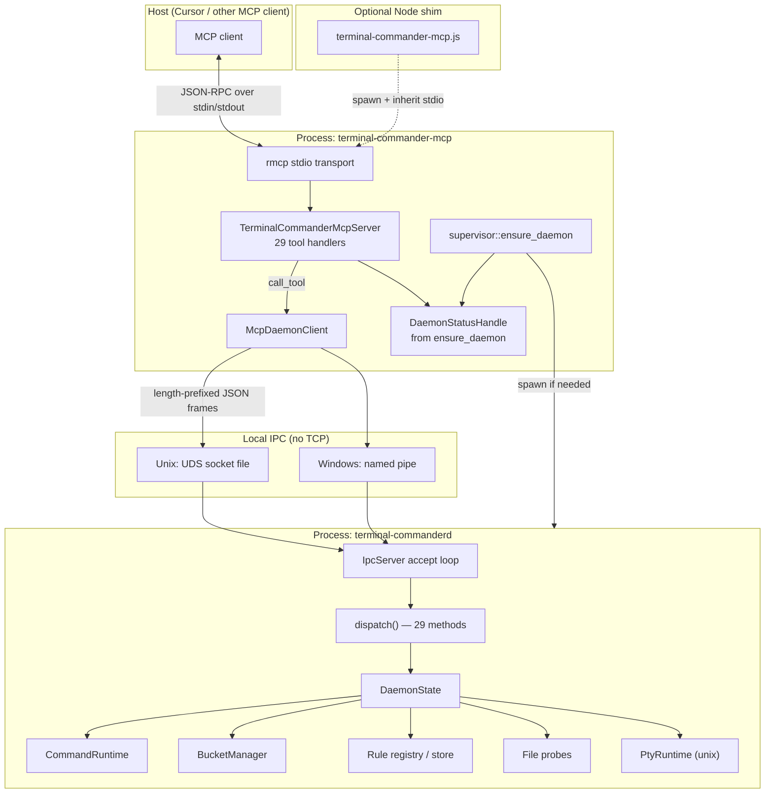
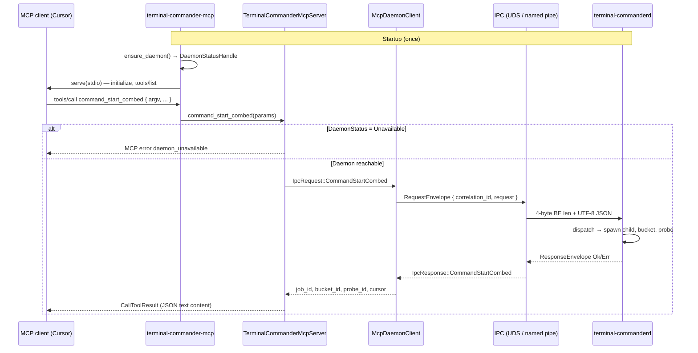
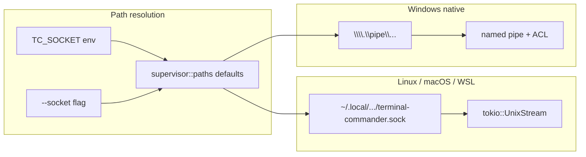
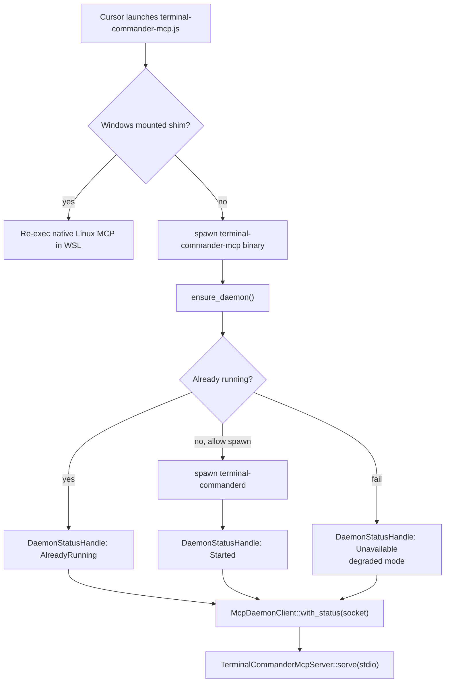
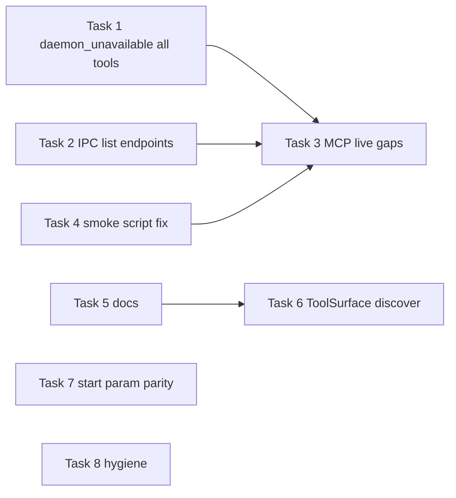

# Planning report: close endpoint-coverage and adapter gaps

**Audience:** code-planning / implementation agent  
**Repo:** `terminal-commander`  
**Context:** Pedantic review of 29 MCP tools ↔ 29 daemon IPC methods (TC45 surface)  
**Goal:** Every live endpoint is structurally registered, contract-documented, **and** proven by automated tests on both IPC and MCP paths—including degraded (`daemon_unavailable`) behavior.

---

## Executive summary

**Inventory is correct; proof is incomplete.**

| Area | Status |
|------|--------|
| Catalogue ↔ router ↔ `system_discover.methods` ↔ fixtures | Aligned (29/29) |
| Daemon IPC happy-path tests | ~27/29; gaps on list endpoints |
| MCP live `call_tool` happy-path | ~23/29; gaps on read-only/status/list tools |
| MCP `daemon_unavailable` envelope | **9/28** tools with explicit integration tests (see below); 19 not spot-checked at MCP layer |
| Legacy `ToolSurface` (`lib.rs`) | Still advertises **5** tools; parallel dead/misleading surface vs 29-tool `tool_catalogue` |
| Smoke script (`test-all-mcp-tools.py`) | Wrong parameter names (real drift; **not** a hard CI gate — optional/manual) |
| Docs / operator strings | Still say “TC40 discovery only” |
| MCP ↔ IPC param parity | All **start** tools drop `bucket_config` + `rules` at MCP layer (see Task 7) |

**Recommended approach:** One planning phase (“endpoint coverage hardening”), 8 task-sized commits (Tasks 1–8), no behavior changes unless Task 7 chooses expose.

---

## Review methodology and caveats

Read this before treating counts in this doc as audited fact.

### What was verified vs estimated

| Claim | Status |
|-------|--------|
| 29 tools in `tool_catalogue()` ↔ router ↔ fixtures | **Verified** (code + `fixture_catalogue_contract` test) |
| `daemon_unavailable` “~11/28” | **Re-counted:** **9/28** daemon-backed tools have an explicit `call_tool` failure test in `daemon_unavailable_envelope.rs` (see list below). Earlier “~11” was approximate; do not cite it. |
| 29-row coverage matrix (Y / — / partial) | **Spot-checked**, not cell-by-cell audited. Implementing agent should re-verify each row when closing tasks. |
| IPC “~27/29” | **Estimated** from test-file grep; list-endpoint gaps confirmed. |
| MCP live “~23/29” | **Estimated** from test-file grep; status/registry/list gaps confirmed. |

**Explicit `daemon_unavailable` integration tests today** (`crates/mcp/tests/daemon_unavailable_envelope.rs`):

`command_start_combed`, `runtime_state`, `probe_list`, `registry_list_active`, `file_watch_list`, `pty_command_list`, `health`, `policy_status`, `self_check`.

Additionally: `system_discover_succeeds_when_daemon_unavailable` validates catalogue metadata for all tools (not per-tool `call_tool`). Unit tests in `tools.rs` duplicate `health` / `policy_status` / `self_check` only (`status_tools_short_circuit_on_unavailable_daemon_status`).

### Production vs legacy MCP surfaces

| Surface | Path | Tool count | Production? |
|---------|------|------------|-------------|
| **rmcp stdio adapter** | `crates/mcp/src/tools.rs` → `tool_catalogue()` | 29 | **Yes** — `terminal-commander-mcp` binary |
| **In-process test facade** | `crates/mcp/src/lib.rs` → `ToolSurface::system_discover()` | **5** hardcoded | **No** — TC23 integration tests (`e2e.rs`, etc.) only |

The review originally flagged stale **doc strings** but missed this **live code** that still returns a 5-tool list:

```rust
// crates/mcp/src/lib.rs — ToolSurface::system_discover (not production path)
tools: vec![
    "system_discover", "bucket_events_since", "bucket_wait",
    "bucket_summary", "event_context",
],
```

Production `system_discover` uses `tool_catalogue()` / `discovered_tools()` in `tools.rs`. The legacy struct is misleading for anyone reading `lib.rs` or test helpers and should be aligned or removed under the same “stale TC40 / dead surface” theme.

### Smoke script priority

`scripts/smoke/test-all-mcp-tools.py` parameter drift is **real** but **lower stakes**: this doc and CI treat it as **optional** (`Verification matrix` → “Smoke (optional)”). Rust integration tests are the enforcement layer. Fix the script for operator ergonomics, not as a P0 gate, unless the team promotes it to required CI.

---

## Architecture reference

### Connection overview

Terminal Commander is a **local stack**: the IDE talks MCP over stdio; the MCP adapter talks to one long-lived daemon over a **platform IPC channel**; the daemon owns commands, buckets, files, PTY, and the rule registry.



### One tool call (example: `command_start_combed`)



### Layer mapping (29 endpoints, 1:1)

| MCP tool name | Daemon IPC `method` | Who does the work |
|---------------|---------------------|-------------------|
| `health`, `policy_status`, `self_check`, `system_discover` | same names | Daemon reads state / runs checks |
| `command_*`, `bucket_*`, `event_context` | same | Daemon `CommandRuntime` + buckets |
| `registry_*` | same | Daemon SQLite registry + activation |
| `file_*` | same | Daemon file probes (policy on paths) |
| `pty_*` | same | Daemon PTY runtime (unix; limited on Windows) |
| `runtime_state`, `probe_*` | same | Daemon aggregate snapshot |

The MCP crate **does not** spawn processes or read files; it only serializes tool args → `IpcRequest` and maps `IpcResponse` / `IpcError` → MCP JSON.

### Transport and addressing



- **Frame format:** 4-byte big-endian length + JSON (`RequestEnvelope` / `ResponseEnvelope`).
- **Cap:** 256 KiB max frame; per-method caps inside the daemon (bucket read limits, file windows, etc.).

### Startup wiring



Even when the daemon is unavailable, the MCP process **stays up**: `system_discover` still works; other tools return `daemon_unavailable` if the supervisor reported `Unavailable` at startup.

### Out of scope for this graph

- No HTTP API for tools — only MCP stdio + daemon IPC.
- CLI (`terminal-commander`) is a separate binary; most daemon-backed subcommands are still stubs.
- Child processes are spawned only inside `terminal-commanderd`, not in the MCP adapter.

---

## Review findings (source)

### Coverage matrix

> **Caveat:** Cells are from spot-checks and grep, not an independent audit. Re-verify each row when marking **Done** in the checklist below.

Legend: **Y** = exercised on happy path in that layer, **partial** = error-only or list-only, **—** = not exercised.

| Endpoint | Daemon IPC | MCP live `call_tool` | MCP `daemon_unavailable` | Contract fixture |
|----------|:----------:|:--------------------:|:------------------------:|:----------------:|
| `system_discover` | Y | Y | N/A | Y |
| `health` | Y | Y | Y | Y |
| `policy_status` | Y | — | Y | Y |
| `self_check` | Y | — | Y | Y |
| `command_start_combed` | Y | Y | Y | Y |
| `command_status` | Y | Y | — | Y |
| `bucket_events_since` | Y | Y | — | Y |
| `bucket_wait` | Y | Y | — | Y |
| `bucket_summary` | Y | Y | — | Y |
| `event_context` | Y | Y | — | Y |
| `registry_search` | Y | — | — | Y |
| `registry_get` | Y | — | — | Y |
| `registry_upsert` | Y | Y | — | Y |
| `registry_test` | Y | Y | — | Y |
| `registry_activate` | Y | Y | — | Y |
| `registry_deactivate` | Y | Y | — | Y |
| `registry_list_active` | Y | Y | partial | Y |
| `file_read_window` | Y | Y | — | Y |
| `file_search` | Y | Y | — | Y |
| `file_watch_start` | Y | Y | — | Y |
| `file_watch_stop` | Y | Y | — | Y |
| `file_watch_list` | — | — | Y | Y |
| `pty_command_start` | Y | Y (unix) | — | Y |
| `pty_command_write_stdin` | Y | Y | — | Y |
| `pty_command_stop` | Y | Y | — | Y |
| `pty_command_list` | partial | — | Y | Y |
| `runtime_state` | Y | Y | Y | Y |
| `probe_list` | Y | Y | Y | Y |
| `probe_status` | Y | Y + unknown error | — | Y |

### Findings by severity

#### High — tests claim coverage they do not perform

- `crates/daemon/tests/pty_ipc.rs` module docs say `pty_command_list` is covered, but the file never issues `IpcRequest::PtyCommandList` on a happy path.
- `file_watch_list` has no daemon integration test (only MCP unavailable envelope + smoke script listing).

#### High — legacy `ToolSurface` advertises 5 tools (dead / misleading)

- `crates/mcp/src/lib.rs`: `ToolSurface::system_discover()` hardcodes five tool names (TC23 bucket/context subset).
- Production rmcp path uses `tools::tool_catalogue()` (29 tools). Tests such as `crates/mcp/tests/e2e.rs` still drive `ToolSurface` in-process.
- **Not** the production path, but misleading for readers of `lib.rs`. Addressed by **Task 6** (small, scoped): delete the hardcoded list or delegate to `tool_catalogue()` — not a full `ToolSurface` removal (`e2e.rs` and `lib.rs` unit tests still use the struct for in-process bucket/registry flows).

#### High — `daemon_unavailable` not enforced for all daemon tools

- Only **9/28** daemon-backed tools have explicit `daemon_unavailable` integration tests (see methodology section).
- Other daemon-backed handlers use inline `daemon.status()` checks; `mcp_stdio` uses `McpDaemonClient::new` (no status) and may hit raw IPC errors instead of the contract envelope.

#### Medium — MCP live gaps (registry read path)

- `registry_get`, `registry_search`, `policy_status`, `self_check` have no live MCP `call_tool` integration test.

#### Low / optional — smoke script uses wrong parameter names

Not a hard CI gate today. Fix when touching operator smoke; do not block endpoint-coverage work on it unless promoted to required CI.

| Tool | Script sends | MCP schema expects |
|------|----------------|-------------------|
| `file_read_window` | `line_count` | `max_lines` |
| `pty_command_write_stdin` | `data` | `bytes` |
| `file_watch_start` | `bucket_id` | not in `McpFileWatchStartParams` |
| `pty_command_start` | `grace_ms` | not in `McpPtyCommandStartParams` |

#### Medium — MCP layer drops daemon params on every start surface

All three MCP **start** handlers hardcode empty bucket/rule binding while IPC accepts optional `bucket_config` and inline `rules`:

| MCP tool | Handler location | IPC params forced empty |
|----------|------------------|-------------------------|
| `command_start_combed` | `McpCommandStartParams::into_ipc()` | `bucket_config: None`, `rules: []` |
| `file_watch_start` | `file_watch_start` handler | `bucket_config: None`, `rules: []` |
| `pty_command_start` | `pty_command_start` handler | `bucket_config: None`, `rules: []` |

Operators using MCP cannot pass per-job inline rules or bucket overrides; they must rely on `registry_activate` scoping unless Task 7 chooses expose.

#### Low — stale documentation and comments

- `tools.rs`, `main.rs`, `protocol.rs`, and MCP `with_instructions` still describe TC40 four-tool surface.
- `lib.rs` crate/module docs still frame the crate as “TC23 in-process + TC40 discovery/status” without clarifying that rmcp owns the 29-tool surface.

#### Low — inconsistent unavailable guard

- `health` / `policy_status` / `self_check` use `unavailable_startup_daemon_error()`; other tools use inline `daemon.status()` checks.

---

## Non-goals

- Adding new tools or IPC methods
- Changing policy semantics (shell deny, path deny, secret stdin)
- CLI `terminal-commander` daemon-backed subcommands (separate track)
- Windows PTY feature parity (document platform limits only)

---

## Task 1 — Parametrized `daemon_unavailable` coverage (MCP)

**Priority:** P0

**Problem:** Contract fixtures assert `ensure_daemon_status_v1` for all 28 daemon-backed tools, but integration tests only cover **9** today (see methodology).

**Work:**

1. Add `crates/mcp/tests/daemon_unavailable_all_tools.rs` (or extend `daemon_unavailable_envelope.rs`):
   - Build server with `McpDaemonClient::with_status` + `EnsureDaemonStatus::Unavailable`.
   - Iterate `tool_catalogue()`; skip `system_discover`.
   - For each tool, `call_tool` with minimal valid arguments (table-driven).
   - Assert error contains `daemon_unavailable` and does not leak raw transport details.

2. Optional: document or fix behavior when `McpDaemonClient::new` is used without status (production uses `with_status` from `main.rs`).

**Acceptance criteria:**

- [ ] 28/28 daemon-backed tools fail with `daemon_unavailable` when status is `Unavailable`
- [ ] `system_discover` succeeds and marks other tools unavailable honestly
- [ ] CI runs on `cfg(unix)` (match existing envelope tests)

**Files:** `crates/mcp/tests/daemon_unavailable_envelope.rs`, `crates/mcp/src/tools.rs`

---

## Task 2 — Daemon IPC happy-path for list endpoints

**Priority:** P0

**Problem:** `file_watch_list` has no daemon integration test. `pty_command_list` is undocumented in tests.

**Work:**

1. **`file_watch_list`** in `crates/daemon/tests/file_ipc.rs`: start watch → list → assert entry → stop → verify list state.

2. **`pty_command_list`** in `crates/daemon/tests/pty_ipc.rs` (`#![cfg(unix)]`): after start, list contains job; after stop, list reflects stopped state.

3. Fix `pty_ipc.rs` module doc if inaccurate.

**Acceptance criteria:**

- [ ] Both IPC methods have at least one green integration test on unix
- [ ] `pty_unsupported_platform.rs` unchanged for Windows

**Files:** `crates/daemon/tests/file_ipc.rs`, `crates/daemon/tests/pty_ipc.rs`

---

## Task 3 — MCP live smoke for uncovered tools

**Priority:** P1

**Problem:** No live MCP `call_tool` for: `policy_status`, `self_check`, `registry_get`, `registry_search`, `file_watch_list`, `pty_command_list`.

**Work:**

Add `crates/mcp/tests/mcp_live_status_and_registry_e2e.rs` (or extend `mcp_live_daemon.rs`):

| Tool | Minimal call | Assert |
|------|----------------|--------|
| `policy_status` | `{}` | `profile`, numeric caps |
| `self_check` | `{}` | `report`, `failures` |
| `registry_upsert` | fixture rule JSON | (setup) |
| `registry_get` | `rule_id` | `definition` present |
| `registry_search` | `query` | `hits` non-empty |
| `file_watch_start` | temp file path | get `watch_id` |
| `file_watch_list` | `{}` | entry contains `watch_id` |
| `pty_command_start` | `python3 -c ...` or skip | `job_id` |
| `pty_command_list` | `{}` | entry contains `job_id` (unix) |

Reuse `spawn_live_daemon`, `paired_against_live_daemon`, `MAX_RESPONSE_BYTES` from existing MCP live tests.

**Acceptance criteria:**

- [ ] Each listed tool has ≥1 successful `call_tool` against live daemon (unix)
- [ ] PTY tests skip when `python3` unavailable

**Files:** new test file or `mcp_live_daemon.rs`

---

## Task 4 — Fix smoke script ↔ schema drift

**Priority:** P2 (optional operator tooling — not required for initiative done unless team promotes script to CI)

**Work:**

| Tool | Change |
|------|--------|
| `file_read_window` | `line_count` → `max_lines` |
| `pty_command_write_stdin` | `data` → `bytes` |
| `file_watch_start` | remove invalid `bucket_id` |
| `pty_command_start` | remove invalid `grace_ms` |

Add comment: parameter names must match `Mcp*` structs in `crates/mcp/src/tools.rs`.

**Acceptance criteria:**

- [ ] Script does not fail from schema mismatch when daemon is up
- [ ] Windows PTY may remain in `expected_fail` set

**Files:** `scripts/smoke/test-all-mcp-tools.py`

---

## Task 5 — Documentation and stale strings

**Priority:** P2

| Location | Change |
|----------|--------|
| `crates/mcp/src/tools.rs` module doc | 29 live tools; thin MCP facade over daemon IPC |
| `get_info().with_instructions` | Same |
| `crates/mcp/src/main.rs` crate doc + clap | Remove TC40-only wording |
| `crates/daemon/src/ipc/protocol.rs` header | Methods live through TC45 |
| `crates/mcp/src/lib.rs` module doc | State clearly: `ToolSurface` = legacy in-process test facade; production = `tools` + rmcp binary |

**Acceptance criteria:**

- [ ] `rg "discovery/status tools only"` returns zero under `crates/mcp`
- [ ] `lib.rs` documents dual-surface layout without implying 5 tools is the product surface

**Out of scope for Task 5:** changing `ToolSurface::system_discover` behavior → **Task 6**.

---

## Task 6 — `ToolSurface::system_discover` anti-drift cleanup

**Priority:** P2  
**Size:** Small (single file + shared helper; one commit)

**Problem:** `ToolSurface::system_discover()` in `crates/mcp/src/lib.rs` hardcodes five tool names. Production rmcp uses `tools::tool_catalogue()` (29). The struct is **not** dead — `crates/mcp/tests/e2e.rs` and `lib.rs` `#[cfg(test)]` tests still call `ToolSurface` for in-process bucket/registry flows — but the **discover list** must not drift independently.

**Callers to keep green:**

- `crates/mcp/tests/e2e.rs` — `e2e_discover_then_create_and_read_bucket` (asserts `bucket_wait` present)
- `crates/mcp/src/lib.rs` — `discover_lists_mvp_tools`

**Pick one approach (no broad `ToolSurface` deprecation in this task):**

| Option | Action |
|--------|--------|
| **A — Delegate (preferred)** | Add shared helper, e.g. `tools::catalogue_tool_names() -> Vec<&'static str>` or `Vec<String>`, sourced from `tool_catalogue()`. `ToolSurface::system_discover()` sets `tools:` from that helper. Add unit test: `ToolSurface` discover len == `tool_catalogue().len()`. |
| **B — Delete hardcoding only** | If `system_discover` on `ToolSurface` has no remaining callers after audit, remove the method and update tests to use rmcp catalogue tests instead — **do not** delete `ToolSurface` wholesale. |

**Explicit non-goals:**

- Migrating all `e2e.rs` flows to rmcp/daemon (future goal)
- Changing rmcp `system_discover` payload shape

**Acceptance criteria:**

- [ ] No hand-maintained 5-tool `vec![]` in `lib.rs`
- [ ] `ToolSurface::system_discover().tools` matches `tool_catalogue()` names (order may differ; set equality OK)
- [ ] `cargo test -p terminal-commander-mcp` passes (including `e2e` integration tests)

**Files:** `crates/mcp/src/lib.rs`, `crates/mcp/src/tools.rs` (shared name helper), optionally `crates/mcp/tests/e2e.rs` if assertions need tightening

---

## Task 7 — MCP ↔ IPC param parity on all start surfaces

**Priority:** P2  
**Product decision required**

**Problem:** Three MCP **start** tools strip `bucket_config` and inline `rules` that IPC already supports. This is one parity theme, not three unrelated gaps.

| MCP tool | IPC type | Where MCP zeros fields |
|----------|----------|-------------------------|
| `command_start_combed` | `CommandStartParams` | `McpCommandStartParams::into_ipc()` |
| `file_watch_start` | `FileWatchStartParams` | `file_watch_start` handler body |
| `pty_command_start` | `PtyCommandStartParams` | `pty_command_start` handler body |

**Options (apply consistently across all three or document exception per tool):**

| Option | Action |
|--------|--------|
| **A — Document** | MCP tool descriptions + `docs/mcp/TOOL_CONTROL_SURFACE.md`: per-job `bucket_config` / inline `rules` are IPC-only; MCP clients use `registry_activate` with `global` / `bucket` / `job` / `probe` scope. Update fixtures for all three start tools. |
| **B — Expose** | Add optional MCP fields (e.g. `bucket_config_json`, `rules_json` or structured DTOs) to `McpCommandStartParams`, `McpFileWatchStartParams`, `McpPtyCommandStartParams`; map into IPC in handlers. Add MCP e2e: inline rule on `command_start_combed` emits signal without prior `registry_activate`. |
| **C — Narrow IPC** | Only if product rejects inline rules on MCP forever — unlikely; would shrink IPC, not recommended. |

**Acceptance criteria:**

- [ ] Written decision covers **all three** start tools (not only file/pty)
- [ ] Contract fixtures under `tests/fixtures/contracts/mcp-tools/` match decision for `command_start_combed.v1.json`, `file_watch_start.v1.json`, `pty_command_start.v1.json`
- [ ] If **B**: one live MCP test per start family proving rules or bucket config take effect

**Files:** `crates/mcp/src/tools.rs`, `docs/mcp/TOOL_CONTROL_SURFACE.md`, relevant fixture JSON

---

## Task 8 — Code hygiene

**Priority:** P3

1. Remove dead `type_name` line in `runtime_state` handler (`tools.rs`).
2. Unify daemon guard: `ensure_daemon_available(&self) -> Result<(), McpError>` for all tools.
3. Optional parametrized unit test for short-circuit behavior.

---

## Execution order



| Wave | Tasks |
|------|--------|
| Wave 1 (CI trust) | 1, 2 |
| Wave 2 (E2E completeness) | 3 |
| Wave 3 (polish) | 5, 6, 7, 8 |
| Optional / operator | 4 (smoke script) |

---

## Verification matrix (definition of done)

| Check | Command / artifact |
|-------|-------------------|
| Unit + integration | `cargo nextest run -p terminal-commander-mcp -p terminal-commanderd` |
| Fixture drift | `cargo test -p terminal-commander-mcp fixture_map_matches_live_tool_catalogue` |
| Smoke (optional) | `python scripts/smoke/test-all-mcp-tools.py` |
| Catalogue invariant | `catalogue_lists_twenty_nine_live_tools_at_tc45` |
| Coverage checklist | 29 rows × {ipc_ok, mcp_live_ok, unavail_ok, fixture_ok} updated in this file |

---

## Risk register

| Risk | Mitigation |
|------|------------|
| Flaky `bucket_wait` / PTY in CI | Short timeouts; skip without `python3` |
| Windows PTY absent | `#[cfg(unix)]` on PTY live tests |
| Parametrized unavail needs valid args | Centralize `minimal_tool_args(name)` test helper |
| Large single PR | One commit per task |

---

## Copy-paste prompt for planning agent

```text
Implement "endpoint coverage hardening" for terminal-commander per .planning/endpoint-coverage-hardening.md:

1. P0: Parametrized MCP test — all 28 daemon-backed tools return daemon_unavailable when DaemonStatusHandle is Unavailable (minimal valid args per tool).
2. P0: Daemon IPC tests for file_watch_list (happy path) and pty_command_list (happy path on unix); fix pty_ipc module doc if inaccurate.
3. P1: MCP live e2e for policy_status, self_check, registry_get, registry_search, file_watch_list, pty_command_list (reuse spawn_live_daemon pattern).
4. P2 (optional): Fix scripts/smoke/test-all-mcp-tools.py parameter names — only if promoting smoke to CI.
5. P2: Update stale TC40-only docs (tools.rs, main.rs, protocol.rs, lib.rs module comments). Do not change ToolSurface discover here.
6. P2: ToolSurface::system_discover cleanup — remove hardcoded 5-tool vec; delegate to tool_catalogue() via shared helper OR delete method if unused; keep ToolSurface for e2e.rs; add anti-drift test (len/names match catalogue).
7. P2: Product decision on MCP bucket_config/rules parity for ALL start surfaces: command_start_combed, file_watch_start, pty_command_start — document OR expose consistently; update all three fixtures.
8. P3: Remove runtime_state type_name dead code; unify daemon availability guard helper.

Do not add new endpoints. Minimize behavior change unless task 7 chooses expose. Each task should be a separate commit. Verification: cargo nextest for mcp + daemon crates; fixture_catalogue_contract test must pass.
```

---

## Endpoint checklist (29 tools)

Track completion in the **Done** column as tasks land.

| # | Tool | IPC test | MCP live | MCP unavail | Fixture | Done |
|---|------|:--------:|:--------:|:-----------:|:-------:|:----:|
| 1 | `system_discover` | Y | Y | N/A | Y | ✓ |
| 2 | `health` | Y | Y | Y | Y | ✓ |
| 3 | `policy_status` | Y | Y | Y | Y | ✓ |
| 4 | `self_check` | Y | Y | Y | Y | ✓ |
| 5 | `command_start_combed` | Y | Y | Y | Y | ✓ |
| 6 | `command_status` | Y | Y | Y | Y | ✓ |
| 7 | `bucket_events_since` | Y | Y | Y | Y | ✓ |
| 8 | `bucket_wait` | Y | Y | Y | Y | ✓ |
| 9 | `bucket_summary` | Y | Y | Y | Y | ✓ |
| 10 | `event_context` | Y | Y | Y | Y | ✓ |
| 11 | `registry_search` | Y | Y | Y | Y | ✓ |
| 12 | `registry_get` | Y | Y | Y | Y | ✓ |
| 13 | `registry_upsert` | Y | Y | Y | Y | ✓ |
| 14 | `registry_test` | Y | Y | Y | Y | ✓ |
| 15 | `registry_activate` | Y | Y | Y | Y | ✓ |
| 16 | `registry_deactivate` | Y | Y | Y | Y | ✓ |
| 17 | `registry_list_active` | Y | Y | Y | Y | ✓ |
| 18 | `file_read_window` | Y | Y | Y | Y | ✓ |
| 19 | `file_search` | Y | Y | Y | Y | ✓ |
| 20 | `file_watch_start` | Y | Y | Y | Y | ✓ |
| 21 | `file_watch_stop` | Y | Y | Y | Y | ✓ |
| 22 | `file_watch_list` | Y | Y | Y | Y | ✓ |
| 23 | `pty_command_start` | Y | Y | Y | Y | ✓ |
| 24 | `pty_command_write_stdin` | Y | Y | Y | Y | ✓ |
| 25 | `pty_command_stop` | Y | Y | Y | Y | ✓ |
| 26 | `pty_command_list` | Y | Y | Y | Y | ✓ |
| 27 | `runtime_state` | Y | Y | Y | Y | ✓ |
| 28 | `probe_list` | Y | Y | Y | Y | ✓ |
| 29 | `probe_status` | Y | Y | Y | Y | ✓ |

**Gaps closed:** Tasks 1–10 landed. MCP `daemon_unavailable` is now table-driven over `tool_catalogue()` (28/28 daemon-backed tools); `file_watch_list` + `pty_command_list` have happy-path IPC tests; live MCP `call_tool` tests cover `policy_status`, `self_check`, `registry_get`, `registry_search`, `file_watch_list`, `pty_command_list`; the three `*_start` tools expose `bucket_config` + inline `rules` with passing live proof; `ToolSurface::system_discover` delegates to `tool_catalogue()`; stale TC40 docs removed; smoke-script params aligned; CI off Node 20; verify-jobs fire on `workflow_dispatch`.

**Matrix audit:** Cells reflect the landed Tasks 1–10 (commits `1c1863f`…`dd78a86`); the full workspace gate (`cargo fmt`/`clippy`/`nextest` + `npm test`) is green.

---

## Related paths

| Path | Role |
|------|------|
| `crates/mcp/src/tools.rs` | **Production** MCP catalogue + rmcp handlers (29 tools) |
| `crates/mcp/src/lib.rs` | Legacy `ToolSurface` (in-process tests; 5-tool `system_discover`) |
| `crates/daemon/src/ipc/protocol.rs` | IPC method union |
| `crates/daemon/src/ipc/server.rs` | Dispatcher + `system_discover.methods` |
| `tests/fixtures/contracts/mcp-tool-fixture-map.v1.json` | Fixture truth table |
| `crates/mcp/tests/fixture_catalogue_contract.rs` | Drift guard |
| `scripts/smoke/test-all-mcp-tools.py` | Manual / CI smoke |

---

## Locked decisions + folded-in scope (2026-05-26, operator-confirmed)

- **Task 7 (start-surface param parity) → Option B (Expose).** Add optional `bucket_config` + inline `rules` to `McpCommandStartParams`, `McpFileWatchStartParams`, `McpPtyCommandStartParams`; map through to IPC in the handlers (replacing the hardcoded `bucket_config: None` / `rules: vec![]`). Add one live MCP test per start family proving an inline rule/bucket override takes effect without prior `registry_activate`. Update all three contract fixtures. This is the only `feat:` in the set → earns the version bump.
- **Cadence → autonomous, all waves.** TDD every task (red → green), one conventional commit per task. Commit types: Tasks 1/2/3 `test:`, Task 4 `test:`/`fix:`, Task 5 `docs:`, Task 6 `refactor:`, Task 7 `feat:`, Task 8 `refactor:`, Tasks 9/10 `ci:`. Only `feat:`/`fix:` publish via the (now-fixed) release loop, so the set yields a single clean patch publish; operator installs + tests live.
- **Scope folds in CI hygiene** (the release-pipeline work on 2026-05-26 surfaced these):

**Task 9 — Bump CI actions off Node 20 (`ci:`).** GitHub forces Node 24 on 2026-06-02, removes Node 20 on 2026-09-16; every release/build job currently warns. Either pin `actions/checkout`, `actions/setup-node`, `actions/upload-artifact`, `actions/download-artifact`, `googleapis/release-please-action` to Node24-capable refs, or set `FORCE_JAVASCRIPT_ACTIONS_TO_NODE24: true` workflow-wide (as the symforge pipeline does).

**Task 10 — Fix verify-jobs `workflow_dispatch` gating (`ci:`).** `verify-{platform}` jobs in `release-please.yml` only fire on `push`; their `if:` should also accept `workflow_dispatch` so the `force_publish` recovery path is actually verified instead of skipped.

**Execution note:** the release pipeline is now hands-off (release-please + release-pr-sync, fixed 2026-05-26 — see agentmemory `mem_mpmhijzd`). Each `fix:`/`feat:` commit auto-bumps + auto-publishes all 6 npm packages, so a hardened endpoint is verifiable on the *published* binary, not just CI.
