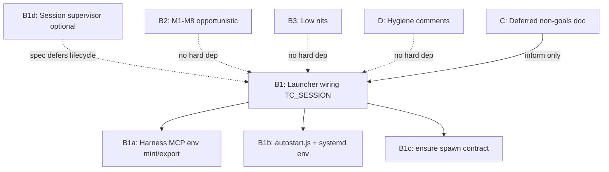

# Open work index (as_of 2026-05-27, package v0.1.25)

**Repo:** `terminal-commander`  
**Git:** branch `main`, commit `1e0fc81` (`Merge pull request #31 from special-place-ai-heaven/release-please--branches--main`)  
**Recent:** `fbd91c6` chore sync versions · `69286a1` fix(supervisor) reject dot-only TC_SESSION

## Executive summary

| Bucket | Priority | Status | Blocks product promise? |
|--------|----------|--------|-------------------------|
| **B1** F1 launcher wiring | CRITICAL | Rust F1 **shipped**; JS/harness **dormant** | **Yes** — multi-agent isolation requires something to set `TC_SESSION` and align autostart/spawn |
| **B2** M1–M8 | MEDIUM | Open (M4 largely mitigated in code; verify) | No for single-harness; yes for CI reliability at scale |
| **B3** Low nits | LOW | Open | No |
| **D** Hygiene | LOW | Open | No |
| **C** Deferred | — | Document only | N/A |

**Load-bearing path:** Only **B1** unlocks the per-harness product story advertised post-F1. Everything else is quality, flake resistance, or hygiene.

## Dependency graph

## Priority order (recommended execution)

1. **B1 Phase 1–3** — harness writes `TC_SESSION`; autostart exports it; spawn/ensure contract documented and tested (see `B1-f1-launcher-wiring/PLAN.md`).
2. **B1 Phase 4** (optional / product call) — session supervisor: stable mint, pidfile per session dir (Rust path already keys off `resolve_state_dir_with`), idle reap. **Conflicts with F1 spec non-goals** unless explicitly promoted to a new milestone.
3. **B2** — M8, M3, M2, M1 (test flake); M6, M5, M7 (small correctness/DX); skip or close **M4** if `pid_belongs_to_daemon` at kill is accepted.
4. **B3** — batch low-risk cleanups.
5. **D** — comment hygiene + `ToolStatus::NotImplemented` decision.
6. **C** — keep as reference only (`C-deferred-non-goals.md`).

## Planning artifacts

| Path | Purpose |
|------|---------|
| [B1-f1-launcher-wiring/PLAN.md](./B1-f1-launcher-wiring/PLAN.md) | Phased launcher plan |
| [B1-f1-launcher-wiring/ADVERSARIAL-REVIEW.md](./B1-f1-launcher-wiring/ADVERSARIAL-REVIEW.md) | B1 challenge + verdict |
| [B2-medium-audit/PLAN.md](./B2-medium-audit/PLAN.md) | M1–M8 verified symptoms + fixes |
| [B2-medium-audit/ADVERSARIAL-REVIEW.md](./B2-medium-audit/ADVERSARIAL-REVIEW.md) | Bundle review |
| [B3-low-nits/PLAN.md](./B3-low-nits/PLAN.md) | Line-verified nits |
| [B3-low-nits/ADVERSARIAL-REVIEW.md](./B3-low-nits/ADVERSARIAL-REVIEW.md) | Triviality check |
| [D-hygiene/PLAN.md](./D-hygiene/PLAN.md) | Stale deferred comments + enum |
| [D-hygiene/ADVERSARIAL-REVIEW.md](./D-hygiene/ADVERSARIAL-REVIEW.md) | Brief pass |
| [C-deferred-non-goals.md](./C-deferred-non-goals.md) | Non-implementation table |

## Related existing planning

- Endpoint coverage hardening: [`.planning/endpoint-coverage-hardening.md`](../endpoint-coverage-hardening.md) (orthogonal to B1; MCP proof gaps).
- F1 implementation (Rust, **done**): `docs/superpowers/plans/2026-05-27-per-harness-session-endpoint.md`, spec `docs/superpowers/specs/2026-05-27-per-harness-session-endpoint-design.md`.
- Flakiness audit source: `docs/audits/2026-05-27-full-spectrum-flakiness-fragility-audit.md`.

## Ledger corrections (verified 2026-05-28)

| Ledger claim | Verdict | Evidence |
|--------------|---------|----------|
| F1 capability shipped | **CONFIRMED** (Rust) | `crates/supervisor/src/session.rs:48-62`, `paths.rs:57-63` |
| Nothing fires `TC_SESSION` in JS | **CONFIRMED** | Zero matches under `packages/` (SymForge `search_text`) |
| `lib/daemon/autostart.js` path | **WRONG path** | Actual: `packages/terminal-commander/lib/daemon/autostart.js` |
| M4 probe→kill TOCTOU open | **LIKELY WRONG / stale** | `replace.rs:230-242` re-verify at kill; audit marks F3 **SHIPPED** |
| `daemon/server.rs:1444` | **WRONG path** | Actual: `crates/daemon/src/ipc/server.rs:1444-1456` |
| `bin/terminal-commander-mcp.js:34` dead `bridge_required` | **WRONG line/file** | `bridge_required` at `terminal-commander.js:264`, `terminal-commanderd.js:34`; mcp.js:37 is `result.reason !== "ok"` |
| M2 `ipc_bucket.rs` 400/500/800ms | **PARTIAL drift** | That file uses 40/50ms (`ipc_bucket.rs:122,254,366`); 400/800ms in `pty_ipc.rs`, `file_ipc.rs`, etc. |

## Plan corrections (verified 2026-05-28, supersede B1/B2 PLAN as-written)

| Correction | Why | Where |
|------------|-----|-------|
| **B1 Phase 3: do NOT widen `FORWARDED_ENV_ALLOWLIST`** | Daemon must never re-resolve `TC_SESSION`; parent computes endpoint → sets `TC_SOCKET` (`ensure.rs:212-222`). Adding it breaks the single-source invariant. Phase 3 = comment + docs + E2E test only | `B1-f1-launcher-wiring/PLAN.md` Phase 3 |
| **Windows+WSL `WSLENV` forwarding is a HARD AC (AC6)** | `wsl.exe` drops Windows env unless named in `WSLENV` (zero `WSLENV` in repo). Flagship Cursor-on-Windows path stays shared-daemon without it | `B1` AC6 + Phase 2a |
| **B1 Phase 4 (session supervisor) excluded from B1 done** | F1 spec non-goal (`spec:179-184`); operator chose spec-aligned scope; needs own spec/ADR | `B1` Phase 4 |
| **M4 closed, not "verify"** | `replace.rs:234` `pid_belongs_to_daemon` already closes the kill-time TOCTOU. Add regression test only | `B2-medium-audit/PLAN.md` M4 |
