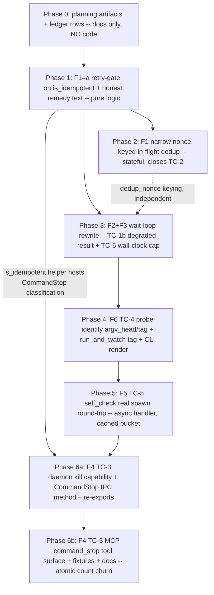

# TC trust-defects campaign index (as_of 2026-06-05)

**Repo:** `terminal-commander`
**Git:** branch `fix/tc-trust-defects`, base commit `725e223`
**Posture:** Trust-first minimal-blast remediation of six verified defects
(TC-1a/b, TC-2, TC-3, TC-4, TC-5, TC-6). Governing axiom: NO returned error
hides a side effect; NO caller -- nor the adapter retrying on its behalf -- is
told to retry a non-idempotent op; EVERY returned state maps to caller intent.

Source artifacts: `plan-final.json` (synthesized 7-phase plan), `review-verdict.json`
(adversarial verdict: approve-with-amendments, 8 required + 16 optional, all
adopted), `research-R5-conventions-process.json` (repo conventions). The per-defect
plans below are the AMENDED versions (every required amendment + adopted optional
folded in).

Language: ASCII only.

## Executive summary

| TC-id | Priority | Status | Blocks product promise? |
|-------|----------|--------|-------------------------|
| **TC-1a** double-spawn on client-timeout blind retry | **P0** | Open (fix Phase 1) | **Yes** -- a >5s client timeout makes the adapter re-send a cloned mutating start => DOUBLE SPAWN; the "run a command safely" promise is violated at HEAD |
| **TC-1b** lost job handle on mid-wait IPC error | **P0** | Open (fix Phase 3) | **Yes** -- run_and_watch discards a known live job_id on any mid-loop RPC error, returning a bare error; the agent cannot recover the running job |
| **TC-2** no in-flight dedup (manual re-call double-spawn) | **P1** | Open (fix Phase 2) | Partial -- the residual manual/LLM re-call double-spawn window after Phase 1; trust defense-in-depth |
| **TC-3** no command-job stop tool | **P1** | Open (fix Phase 6a + 6b) | Partial -- a started command job cannot be stopped from the MCP surface (only PTY can); advertised lifecycle control is incomplete |
| **TC-4** anonymous runtime_state probe rows | **P1** | Open (fix Phase 4) | No (UX/identity) -- probe rows carry no tag/argv; run_and_watch cannot tag its probe (into_parts tag:None) |
| **TC-5** self_check false-green (never spawns) | **P1** | Open (fix Phase 5) | Partial -- self_check hardcodes failures:0 and never exercises a real spawn; lied to live clients during the TC-1/TC-6 window |
| **TC-6** run_and_watch wait cap self-violation | **P1** | Open (fix Phase 3) | No (honesty) -- wait_ms=60000 advertised cap is exceeded (~62-70s wall) by slice-count arithmetic + RTTs |

**Load-bearing path:** Phase 1 alone stops the production double-spawn (TC-1a) and
is independently mergeable. Phase 3 closes the two honesty defects (TC-1b lost
handle + TC-6 cap overrun) in one wait-loop rewrite. The rest are
defense-in-depth (Phase 2), identity (Phase 4), self-check honesty (Phase 5),
and the only multi-surface item, command_stop (Phase 6a/6b), isolated last.

## Dependency graph

Hard ordering edges: Phase 1 introduces the `is_idempotent()` helper that Phase 2
(nonce gate) and Phase 6a (CommandStop classification) both depend on. Phase 6b
depends on Phase 6a (the IPC method + DISCOVERABLE_METHODS entry must exist before
the MCP tool surface and parity fixtures land). All other edges are
harm-reduction sequencing, not hard technical dependencies.

## Priority order (recommended execution)

1. **Phase 0** -- this index + per-defect plans + BACKLOG/RISK_REGISTER rows
   (docs only, NO code).
2. **Phase 1** -- the URGENT regression kill: gate the retry on
   `request.is_idempotent()`, fix the lying transport_unavailable_error doc
   comment + remedy text. Pure logic, smallest blast radius, merges immediately.
3. **Phase 2** -- the stateful narrow in-flight dedup that genuinely closes TC-2,
   isolated from the urgent Phase 1 per the unanimous scope-discipline note.
4. **Phase 3** -- F2+F3 co-designed wait-loop rewrite (TC-1b degraded result +
   TC-6 wall-clock deadline). MUST be one phase (shared loop body
   tools.rs:650-709).
5. **Phase 4** -- TC-4 probe-row identity (argv_head via the NEW argv redactor +
   tag), run_and_watch into_parts tag fix, CLI render.
6. **Phase 5** -- TC-5 self_check real spawn round-trip (async handler, ONE
   cached immortal bucket, profile-gated skip-or-assert-deny, negative test).
7. **Phase 6a** -- TC-3 daemon kill capability (take_cancel_handle + JobBinding
   cancel field + command waiter terminal-state guard) + CommandStop IPC method +
   re-exports + dispatch, behind no MCP tool yet.
8. **Phase 6b** -- TC-3 MCP command_stop tool surface + the atomic count-anchor
   set (5 name lists + 3 count assertions + fixture map + system_discover fixture
   + minimal_tool_args) + docs. Isolated last because it is the only phase that
   perturbs the tool-count surface (37 -> 38).

## Planning artifacts

| Path | Purpose |
|------|---------|
| [PLAN-TC1-ghost-spawn.md](./PLAN-TC1-ghost-spawn.md) | Phase 1: is_idempotent retry-gate + honest remedy (TC-1a) |
| [PLAN-TC2-dedup.md](./PLAN-TC2-dedup.md) | Phase 2: narrow nonce-keyed in-flight dedup (TC-2) |
| [PLAN-TC1b-TC6-waitloop.md](./PLAN-TC1b-TC6-waitloop.md) | Phase 3: wait-loop rewrite degraded result + wall-clock cap (TC-1b + TC-6) |
| [PLAN-TC4-probe-identity.md](./PLAN-TC4-probe-identity.md) | Phase 4: probe-row identity argv_head/tag + run_and_watch tag (TC-4) |
| [PLAN-TC5-selfcheck-spawn.md](./PLAN-TC5-selfcheck-spawn.md) | Phase 5: self_check real spawn round-trip (TC-5) |
| [PLAN-TC3-command-stop.md](./PLAN-TC3-command-stop.md) | Phase 6a/6b: command_stop daemon kill + IPC method + MCP surface (TC-3) |
| [ADVERSARIAL-REVIEW.md](./ADVERSARIAL-REVIEW.md) | Human-readable review summary: verdict, 8 required amendments, adopted optional, rejected findings |
| [plan-final.json](./plan-final.json) | Synthesized 7-phase implementation plan (machine artifact) |
| [review-verdict.json](./review-verdict.json) | Adversarial verdict + amendments (machine artifact) |
| [research-R5-conventions-process.json](./research-R5-conventions-process.json) | Repo conventions: gate scripts, planning shapes, BACKLOG/RISK_REGISTER rules |

## Related existing planning

- Open-work campaign (format precedent): [`.planning/open-work/00-INDEX.md`](../open-work/00-INDEX.md).
- Endpoint coverage hardening: [`.planning/endpoint-coverage-hardening.md`](../endpoint-coverage-hardening.md) (orthogonal; MCP proof gaps).
- Governing MCP contract: `docs/mcp/TOOL_CONTROL_SURFACE.md` + `docs/runtime/REALTIME_SIGNAL_CHANNEL.md` (SPEC-13 subordinates SPEC-8 for the runtime contract; run_and_watch / command_stop doc changes land there with a SPEC-8/SPEC-13 amendment cross-reference, NOT in SPEC-8 in isolation).
- Tracking: this campaign adds BACKLOG rows (P0 TC-1a/TC-1b; P1 TC-2..TC-6; DEFERRED) and RISK_REGISTER rows R-07/R-08/R-09/R-10 (append-only).

## Ledger corrections (verified 2026-06-05 against base commit 725e223)

| Claim | Verdict | Evidence |
|-------|---------|----------|
| MCP tool count is 29 (README/RELEASE_CHECKLIST) | **STALE / and the README figure is itself wrong** | RELEASE_CHECKLIST.md:61 (">=29 tools"), :71 ("29-tool"), :312 ("29-tool TC45 catalogue unchanged"); BACKLOG.md:78 ("29-tool catalogue"). NOTE: README.md does NOT say 29 -- it says 31 (README.md:201 "31 live tools", :292 "31 live tools today"). Live code asserts 37. The plan artifact's lumping of README at "29" is inaccurate; README is stale at 31, RELEASE_CHECKLIST/BACKLOG stale at 29. |
| MCP tool count is 32 (TOOL_CONTROL_SURFACE.md) | **STALE** | docs/mcp/TOOL_CONTROL_SURFACE.md:61 ("exposes 32 live tools"). Catalogue table (:59-71) shows 32 and a PTY stop tool but NO command-job stop -- confirming the TC-3 gap at the contract level. |
| Live MCP tool count is 37 | **CONFIRMED authoritative at HEAD** | crates/mcp/src/lib.rs:12 ("all 37 live tools"); crates/mcp/src/tools.rs:29 ("all 37 tools forward through daemon IPC"); tools.rs:3232 (test `catalogue_lists_thirty_seven_live_tools`); crates/mcp/tests/mcp_live_daemon.rs:213 ("exactly 37 live tools (32 + subscription_open/pull/list/close/seek)"). Adding command_stop makes 38; only the gated assertions + the normative TOOL_CONTROL_SURFACE table get updated, not the non-gated stale README/RELEASE_CHECKLIST references (full sweep DEFERRED). |
| transport_unavailable_error doc comment: "never a raw internal_error (-32603)" | **FALSE (documented lie)** | crates/mcp/src/tools.rs:1790-1796 (doc comment claims "a clean, recoverable signal, never a raw `internal_error` (-32603)") while the body at tools.rs:1808 returns `McpError::internal_error("daemon_unavailable", ...)` -- which IS numeric -32603. The doc comment lies about the very wire code it produces. Fix in Phase 1 (correct the comment + the remedy text). |
| transport_unavailable_error remedy: "retry the tool" | **FALSE for mutating ops (footgun)** | crates/mcp/src/tools.rs:1804-1805 ("the daemon was unavailable; retry the tool -- the adapter re-establishes the daemon on the next call"). For a mutating op (a started command) this remedy instructs a re-send that double-spawns. Phase 1 splits into a mutating variant whose operation-neutral remedy says "this mutating operation may or may not have taken effect; call command_status/runtime_state to confirm the actual state before re-issuing." |
| CONTRIBUTING branch doctrine: default branch `feature/terminal-commander-mvp`, `main` prohibited, goal files under `.agent/goals/` | **DEAD doctrine (doc-vs-reality drift)** | CONTRIBUTING.md:12-26 (default working branch `feature/terminal-commander-mvp`; `main`/`master` prohibited; every goal declares `target_branch`/`prohibited_branches`). LIVE repo has graduated: HEAD branches off `main`, work lands as release-please-driven Conventional-Commit PRs to `main` (research-R5 evidence: git log feat:/fix:/chore: + (#NN), release-please merges). The campaign follows the LIVE convention (branch -> Conventional-Commit PR -> review -> merge to main); it does NOT obey CONTRIBUTING literally or invent `.agent/goals/` files. Full reconciliation DEFERRED (not corrected by this defect campaign). |
| CONTRIBUTING co-author footer: "Claude Opus 4.7 (1M context)" | **STALE** | research-R5 evidence: CONTRIBUTING.md:263 still says `Claude Opus 4.7`; live commits use `Co-Authored-By: Claude Opus 4.8 (1M context) <noreply@anthropic.com>`. Use the live form. |
| PolicyAction::CommandSignal is dormant (no production evaluate() caller) | **CONFIRMED** | policy.rs:62 (variant defined); appears only in deny-matrix arms (policy.rs:228-230, grouped with CommandStart in read_only_observer deny set), target_path None at policy.rs:429, and tests; NO production `evaluate()` caller. TC-3 reuses it (no new variant) and policy-gates command_stop (improving on PTY's ungated stop). |
| format_argv_metadata redacts argv secrets | **FALSE (only truncates)** | crates/daemon/src/command.rs:989-1004 (per-item 128-byte truncate, serializes verbatim, redacts NOTHING). The ONLY redaction in the tree is per-rule capture redaction on command OUTPUT lines (crates/sifters/src/lib.rs:309-343), never on argv. TC-4 (Phase 4) therefore requires a NEW argv redactor before argv_head ships. |
| handle_self_check has a second dispatch site (dispatch_envelope) needing .await | **PHANTOM (deleted)** | handle_self_check has exactly ONE caller: dispatch() at server.rs:541. dispatch_envelope (server.rs:821-828) is a one-line delegate `dispatch(state, boot, req_env, peer).await` with NO SelfCheck arm; the named-pipe server reaches SelfCheck transitively. Making handle_self_check async needs `.await` at EXACTLY ONE place (server.rs:541) and ZERO changes to dispatch_envelope/pipe_server. The "BOTH dispatch sites" graft was a misread; deleted in the amended Phase 5 plan. |
| command waiter shares the PTY terminal-state idempotency guard | **FALSE for the command path** | The checked-then-skipped guard exists ONLY in the PTY waiter (pty_command.rs:391-400). The command waiter (command.rs:668-680) unconditionally calls finish/cancel then bucket_append with NO terminal guard; jobs.finish/cancel (job.rs:154-184, :187-207) are themselves non-idempotent. Phase 6a must ADD a mirror guard to the command waiter or command_stop double-emits. |
