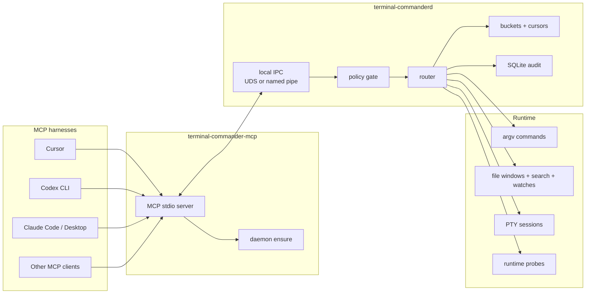
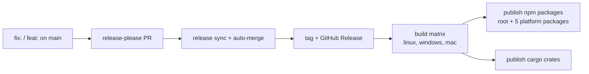

# Terminal Commander

Terminal Commander is a local MCP control plane for coding agents. It gives
Cursor, Codex CLI, Claude Code, Claude Desktop, and other MCP clients a bounded
tool surface for commands, files, PTYs, runtime state, and signal context.

Raw terminal output stays out of the model transcript. The agent receives
structured events, cursors, counters, and explicit context windows instead.

| It is | It is not |
| --- | --- |
| A local daemon plus MCP stdio adapter | A remote service |
| An argv-first command and file signal channel | A generic shell bridge |
| A harness-config writer for MCP clients | A hidden npm bootstrapper |
| A bounded JSON tool surface for LLMs | A human terminal UI |

Latest release: [GitHub Releases](https://github.com/special-place-ai-heaven/terminal-commander/releases/latest) and [npm `latest`](https://www.npmjs.com/package/terminal-commander).

## Quick Start

Install from npm:

```powershell
npm install -g terminal-commander@latest
```

The npm install is intentionally passive:

- no `postinstall` bootstrap
- no MCP config writes
- no daemon start
- no WSL install
- no shell wrapper
- no hidden-window helper spawn

Configure detected harnesses explicitly:

```powershell
terminal-commander setup harness
```

Or target one harness:

```powershell
terminal-commander setup harness --provider cursor
terminal-commander setup harness --provider codex-cli
terminal-commander setup harness --provider claude-code
terminal-commander setup harness --provider claude-desktop
```

Verify:

```powershell
terminal-commander doctor harness
terminal-commander doctor daemon
terminal-commander --version
```

When a harness starts `terminal-commander-mcp`, the MCP adapter uses local IPC
to talk to `terminal-commanderd`. If the daemon is not already running, the
adapter tries to start the sibling daemon binary and reports the result on
stderr.

## Update

Update the npm-managed install:

```powershell
terminal-commander update
```

`terminal-commander update` runs the same public npm install command:

```powershell
npm install -g terminal-commander@latest
```

On Windows, update first runs a native preflight that terminates only these
Terminal Commander binaries when their executable path is inside the current
npm platform package `bin` directory:

- `terminal-commander.exe`
- `terminal-commanderd.exe`
- `terminal-commander-mcp.exe`

It does not call `cmd.exe`, PowerShell, `taskkill`, hidden windows, broad
process-name matches, or downloaded helper scripts.

`terminal-commander --version` prints the installed version and, when npm is
reachable quickly, prints a one-line update notice if a newer release exists.

## Commands On PATH

| Command | Role |
| --- | --- |
| `terminal-commander` | Admin CLI: version, update, setup, doctor, native diagnostics |
| `terminal-commander-mcp` | MCP stdio adapter launched by Cursor/Codex/Claude |
| `terminal-commanderd` | Local daemon for IPC, probes, policy, buckets, and audit |

## Platform Support

| Platform | Package | IPC | Notes |
| --- | --- | --- | --- |
| Linux x64 | `@terminal-commander/linux-x64` | Unix domain socket | Native daemon and MCP adapter |
| Linux arm64 | `@terminal-commander/linux-arm64` | Unix domain socket | Native daemon and MCP adapter |
| Windows x64 | `@terminal-commander/windows-x64` | Named pipe | Native by default |
| macOS x64 | `@terminal-commander/mac-x64` | Unix domain socket | Native package published |
| macOS arm64 | `@terminal-commander/mac-arm64` | Unix domain socket | Native package published |

The old Windows-to-WSL bridge is still available for operators who explicitly
set `TC_USE_LEGACY_WSL_BRIDGE=1`. It is not the default Windows path.

## Architecture



The MCP adapter does not spawn arbitrary commands and does not open network
sockets. It forwards tool calls to the daemon over local IPC. The daemon applies
policy before starting argv commands or returning bounded file/context data.

## How LLMs Should Use It

Use Terminal Commander when raw terminal scrollback would waste context or hide
the signal.

Recommended tool flow:

```text
system_discover
command_start_combed argv=["npm","test"]
bucket_wait bucket_id=<from command_start_combed> cursor=0 timeout_ms=10000
event_context probe_id=<event.probe_id> anchor=<event.anchor> before=20 after=40
command_status job_id=<from command_start_combed>
```

Agent rules:

- Prefer `command_start_combed` for noninteractive commands.
- Use `bucket_wait` instead of polling raw stdout.
- Use `event_context` only when an event pointer needs surrounding text.
- Use `command_status` for exit code, lifecycle state, and counters.
- Do not ask for unbounded output. Every response is intentionally capped.

## MCP Tool Surface

`system_discover` advertises the live tool catalogue. Current tools are grouped
by use:

| Group | Tools |
| --- | --- |
| Discovery and health | `system_discover`, `health`, `policy_status`, `self_check` |
| Commands and buckets | `command_start_combed`, `command_status`, `bucket_wait`, `bucket_events_since`, `bucket_summary`, `event_context` |
| Rule registry | `registry_search`, `registry_get`, `registry_upsert`, `registry_test`, `registry_activate`, `registry_deactivate`, `registry_list_active` |
| Files | `file_read_window`, `file_search`, `file_watch_start`, `file_watch_stop`, `file_watch_list` |
| PTY | `pty_command_start`, `pty_command_write_stdin`, `pty_command_stop`, `pty_command_list` |
| Runtime | `runtime_state`, `probe_status`, `probe_list` |

Full contract: [`docs/mcp/TOOL_CONTROL_SURFACE.md`](docs/mcp/TOOL_CONTROL_SURFACE.md).

Discovery is the source of truth for availability. `system_discover` returns
`daemon_available` plus per-tool `requires_daemon`, `available`, and
`unavailable_reason`. It remains callable when the daemon is down. Daemon-backed
tools return a structured `daemon_unavailable` error when startup status says
the daemon is unavailable, instead of leaking raw pipe/socket errors.

## Harness Configuration

`terminal-commander setup harness` detects installed harnesses and writes MCP
config for supported providers. Use `--provider` to restrict the write.

| Harness | Server key | Config style |
| --- | --- | --- |
| Cursor | `terminal-commander` | JSON `mcpServers` |
| Codex CLI | `terminal_commander` | TOML `[mcp_servers.terminal_commander]` |
| Claude Code | `terminal_commander` | JSON `mcpServers` |
| Claude Desktop | `terminal_commander` | JSON `mcpServers` |
| Gemini | `terminal_commander` | Stub only until config path is verified |
| Kimi | `terminal_commander` | Stub only until config path is verified |

Generated Cursor stanza:

```json
{
  "mcpServers": {
    "terminal-commander": {
      "type": "stdio",
      "command": "terminal-commander-mcp",
      "args": []
    }
  }
}
```

Guides:

- [`docs/integrations/cursor.md`](docs/integrations/cursor.md)
- [`docs/integrations/codex-cli.md`](docs/integrations/codex-cli.md)
- [`docs/integrations/claude-code.md`](docs/integrations/claude-code.md)
- [`docs/integrations/README.md`](docs/integrations/README.md)

## Doctor And Repair

Diagnostics:

```powershell
terminal-commander doctor harness
terminal-commander doctor daemon
terminal-commander doctor wsl
```

Repair is explicit. There is no hidden auto-repair during npm install.

```powershell
terminal-commander setup harness --force
terminal-commander setup daemon-autostart
```

`doctor wsl` and `setup daemon-autostart` are mainly for Linux/WSL and legacy
Windows-to-WSL bridge installations.

The Rust admin CLI does not synthesize fake daemon data. Daemon-backed
inspection commands that are not wired to live daemon IPC exit `69` with an
`unavailable` message rather than returning empty or not-found success.

## Safety Posture

- npm install is passive.
- Wrapper scripts use direct process spawn with `shell:false`.
- Windows JS runtime helpers do not request hidden subprocess windows.
- The MCP adapter speaks stdio and local IPC only.
- The daemon uses Unix domain sockets on Unix and named pipes on Windows.
- Command execution is argv-first and policy-gated.
- Tool responses are bounded JSON, not raw stream dumps.
- Config writes are explicit setup commands with atomic writes/backups where
  the provider writer supports them.
- Windows update lock handling is scoped to Terminal Commander binaries inside
  the current npm platform package directory.

Security model: [`docs/security/PRIVILEGE_MODEL.md`](docs/security/PRIVILEGE_MODEL.md) and [`SECURITY.md`](SECURITY.md).

## Release Flow

Conventional commits on `main` drive releases through release-please and GitHub
Actions.



| Commit type | Release effect |
| --- | --- |
| `fix:` | Patch release |
| `feat:` | Feature release |
| `docs:`, `chore:`, `ci:` | No release unless configured otherwise |

Details: [`docs/release/release-please-contract.md`](docs/release/release-please-contract.md).

## Develop From Source

```powershell
git clone https://github.com/special-place-ai-heaven/terminal-commander.git
cd terminal-commander
```

Useful checks:

```powershell
cargo fmt --all --check
cargo test -p terminal-commander-cli
node --test packages/terminal-commander/test/*.test.js
```

Local package testing:

```powershell
cd packages/terminal-commander
npm link
terminal-commander --version
terminal-commander setup --help
```

Testing doctrine: [`TESTING.md`](TESTING.md).

## Repository Layout

```text
crates/                                  Rust workspace
  cli/                                   terminal-commander native CLI
  daemon/                                terminal-commanderd
  mcp/                                   terminal-commander-mcp
  supervisor/                            daemon ensure + IPC path helpers
packages/
  terminal-commander/                    npm root wrapper
  terminal-commander-linux-x64/          Linux x64 native package
  terminal-commander-linux-arm64/        Linux arm64 native package
  terminal-commander-windows-x64/        Windows x64 native package
  terminal-commander-mac-x64/            macOS x64 native package
  terminal-commander-mac-arm64/          macOS arm64 native package
docs/                                    architecture, integrations, release docs
examples/provider-harness/              copy-paste MCP config examples
scripts/                                CI, release, and smoke helpers
```

## Current Status

| Area | Status |
| --- | --- |
| Native npm install for Linux, Windows, and macOS | Live |
| Passive install with no lifecycle bootstrap | Live |
| Explicit `terminal-commander setup harness` | Live for Cursor, Codex CLI, Claude Code, Claude Desktop |
| Gemini and Kimi setup | Stub only until config paths are verified |
| MCP stdio adapter and daemon auto-ensure | Live |
| Local IPC | UDS on Unix, named pipe on Windows |
| `terminal-commander update` | Live; Windows lock preflight is native and scoped |
| Legacy Windows-to-WSL bridge | Opt-in with `TC_USE_LEGACY_WSL_BRIDGE=1` |

## License

Apache-2.0. See [`LICENSE`](LICENSE).
