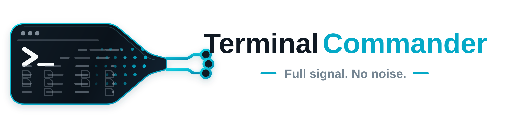
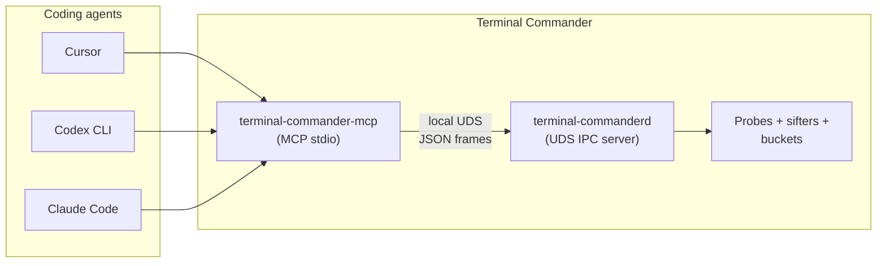
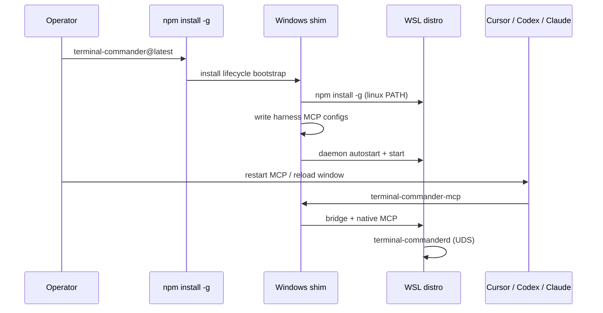
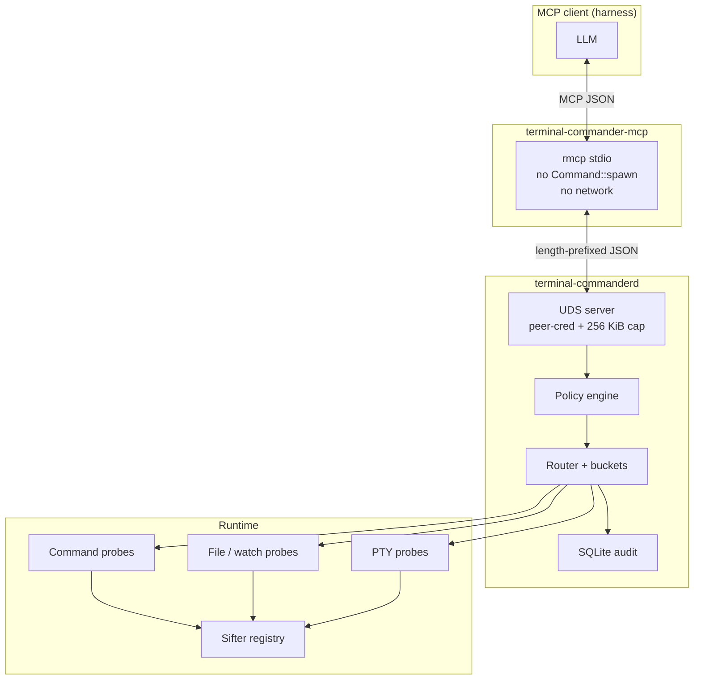
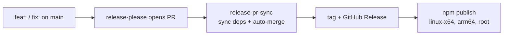

# Terminal Commander

**Local MCP control plane for coding agents** — Cursor, Codex CLI, Claude Code, and other harnesses. Terminal Commander runs on your machine, turns terminal / file / PTY noise into **bounded structured signal**, and exposes it through MCP tools so the model never has to parse raw scrollback.

```text
Raw terminal / file / PTY output goes in.
Only vetted, structured signal comes out.
Context stays available by pointer.
```

| It is | It is not |
|-------|-----------|
| An MCP tool surface for LLMs | A human-facing terminal UI |
| A local daemon + probes + sifters | A remote service or log shipper |
| argv-only command control (policy-gated) | A generic shell bridge |

**Latest release:** [`v0.1.4`](https://github.com/special-place-administrator/terminal-commander/releases/latest) on [npm `latest`](https://www.npmjs.com/package/terminal-commander).

---

## Who this is for

Terminal Commander is **harness-first**. The primary user is the **coding agent** inside your editor or CLI harness. Humans typically run **one install command** and use `doctor` only when something fails.



---

## Install (zero-touch)

### Windows (recommended path)

One command on the host. Bootstrap runs automatically via the npm `install` script:

```powershell
npm install -g terminal-commander@latest
```

That **automatically**:

1. Detects WSL and installs `terminal-commander` **inside** the distro (Linux-first `PATH`, not `/mnt/c` npm shims).
2. Merges MCP config for every **detected** harness (Cursor, Codex, Claude Code, Claude Desktop, …).
3. Installs **daemon autostart** (systemd user unit when available, else profile hook).
4. Starts the daemon if the UDS socket is not already present.

Then **restart your harness** (e.g. reload Cursor MCP). No `setup harness` step required.



**Opt-out:** `set TC_SKIP_BOOTSTRAP=1` before install, or `npm install -g terminal-commander --ignore-scripts`.

### Linux / WSL shell

```sh
npm install -g terminal-commander@latest
```

Installs the matching `@terminal-commander/linux-*` platform package, configures detected harnesses, and sets up daemon autostart on the host.

### Commands on `PATH`

| Command | Role |
|---------|------|
| `terminal-commander-mcp` | MCP stdio adapter (Windows: bridges into WSL) |
| `terminal-commanderd` | Daemon — probes, policy, buckets, audit (Linux/WSL only) |
| `terminal-commander` | Doctor / diagnostics CLI |

---

## Architecture



**Windows note:** Cursor/Codex/Claude on Windows invoke `terminal-commander-mcp` on the host. The shim runs `wsl.exe -d <distro> -- bash -lc '<linux-first PATH> … exec terminal-commander-mcp'`, sources `~/.config/terminal-commander/autostart.sh` so the daemon is up, and avoids the Windows `/mnt/c/.../nodejs` shim that breaks Linux optionalDependencies.

**Platforms:**

| Surface | Linux / WSL2 | Windows host |
|---------|----------------|--------------|
| Daemon + UDS | Yes | No (runs in WSL) |
| MCP stdio | Native | Bridge to WSL |
| npm install bootstrap | Harness + autostart | WSL runtime + harness + autostart |

No macOS-native package. No Windows-native PTY/UDS daemon (deferred).

Deeper docs: [`docs/runtime/REALTIME_SIGNAL_CHANNEL.md`](docs/runtime/REALTIME_SIGNAL_CHANNEL.md), [`docs/runtime/UDS_IPC.md`](docs/runtime/UDS_IPC.md), [`docs/mcp/TOOL_CONTROL_SURFACE.md`](docs/mcp/TOOL_CONTROL_SURFACE.md).

---

## Signal model

- **Probes** observe commands, files, PTY streams, and runtime state.
- **Sifters** + **registry rules** turn raw lines into typed events (errors, stalls, prompts, artifacts, …).
- **Buckets** expose cursor-based, bounded event streams to the LLM.
- **`bucket_wait`** parks until matching signal or a heartbeat timeout — never raw stdout text in the transcript.
- **`event_context`** returns a bounded window around a pointer when the model asks for more context.

---

## Harness configuration

After install, MCP configs should already contain a `terminal-commander` (or `terminal_commander`) entry. If not, first MCP connect runs **lazy bootstrap** (same steps as install).

| Harness | Config location | Auto-configured |
|---------|-----------------|-----------------|
| Cursor | `~/.cursor/mcp.json` (or project `.cursor/mcp.json`) | Yes |
| Codex CLI | `~/.codex/config.toml` → `[mcp_servers.terminal_commander]` | Yes |
| Claude Code | `~/.claude.json` → `mcpServers` | Yes |
| Claude Desktop | `%AppData%\Claude\claude_desktop_config.json` (Windows) | Yes |

**Generated Cursor stanza (Windows bridge):**

```json
{
  "mcpServers": {
    "terminal-commander": {
      "type": "stdio",
      "command": "terminal-commander-mcp",
      "env": {
        "TC_WSL_DISTRO": "Ubuntu-24.04"
      }
    }
  }
}
```

Pin a distro with `TC_WSL_DISTRO` or let the bridge pick the `wsl -l -v` default.

Guides: [`docs/integrations/cursor.md`](docs/integrations/cursor.md), [`docs/integrations/codex-cli.md`](docs/integrations/codex-cli.md), [`docs/integrations/claude-code.md`](docs/integrations/claude-code.md).

Copy-paste examples: [`examples/provider-harness/cursor/`](examples/provider-harness/cursor/).

---

## Daemon lifecycle

On Linux/WSL, install/bootstrap configures autostart. You should **not** need a manual `terminal-commanderd start` for normal harness use.

| Mechanism | When |
|-----------|------|
| systemd user service | WSL/Linux with systemd (common on Ubuntu 24.04 WSL) |
| `~/.config/terminal-commander/autostart.sh` | Profile hook + first MCP bridge connect |
| MCP bridge | Sources autostart before spawning MCP |

**Manual start** (debugging only):

```sh
export TC_DATA="${HOME}/.local/share/terminal-commanderd"
mkdir -p "$TC_DATA"
terminal-commanderd --data-dir "$TC_DATA" start --mode ipc-server
```

Default socket: `$TC_DATA/terminal-commanderd.sock` (override with `TC_SOCKET` in harness env if needed).

---

## Diagnostics

```powershell
# Windows
terminal-commander doctor harness          # detected vs configured MCP
terminal-commander doctor wsl --probe-runtime
terminal-commander doctor daemon         # socket + autostart (0.1.4+)
```

```sh
# Linux / inside WSL
terminal-commander doctor harness
terminal-commander doctor daemon
```

Repair helpers (rare):

```powershell
terminal-commander setup harness --force   # rewrite harness MCP stanzas
terminal-commander setup daemon-autostart   # reinstall autostart unit/hook
```

---

## MCP tools (29)

Representative tools:

```text
health                      system_discover           policy_status
command_start_combed        command_status            bucket_wait
bucket_events_since         bucket_summary            event_context
file_read_window            file_search               file_watch_*
pty_command_*               registry_*                runtime_state / probe_*
```

Full catalogue with bounds and policy gates: [`docs/mcp/TOOL_CONTROL_SURFACE.md`](docs/mcp/TOOL_CONTROL_SURFACE.md).

**Example agent flow:**

```text
command_start_combed  argv=["echo","hello"]
bucket_wait           bucket_id=<from_combed>  cursor=0  timeout_ms=5000
command_status        job_id=<from_combed>
```

Every response is bounded JSON — no raw stream dump in the model context.

---

## Releases (fully automated)

Pushing **Conventional Commits** to `main` drives shipping — no manual release PR merge:



| Commit type | Version bump |
|-------------|--------------|
| `feat:` | minor (pre-1.0 patch semantics via release-please config) |
| `fix:` | patch |
| `chore:`, `docs:`, `ci:` | no release |

The `ensure-release` job backstops tag/GitHub Release/npm if release-please skips a step — operators should **not** hand-tag or run `force_publish` for normal releases.

Details: [`docs/release/release-please-contract.md`](docs/release/release-please-contract.md).

---

## Configuration

Example daemon config: [`config/terminal-commanderd.example.toml`](config/terminal-commanderd.example.toml).

| Setting | Notes |
|---------|--------|
| `daemon.data_dir` | SQLite + socket; must be native Linux fs (not WSL `/mnt/c`) |
| `daemon.socket_path` | Default `<data_dir>/terminal-commanderd.sock` |
| `policy.profile` | `developer_local`, `repo_only`, `read_only_observer`, `admin_debug` |

| Environment | Purpose |
|-------------|---------|
| `TC_SOCKET` | MCP adapter UDS path override |
| `TC_WSL_DISTRO` | Pin WSL distro for Windows bridge |
| `TC_SKIP_BOOTSTRAP` | Skip install/bootstrap |
| `TC_SKIP_DAEMON_AUTOSTART` | Skip daemon service/profile install |

---

## Safety posture

- **No MCP command spawn** — `terminal-commander-mcp` only speaks MCP + UDS.
- **No network listeners** — local Unix socket only, peer credentials checked.
- **No raw stream tools** — bounded JSON envelopes only.
- **Policy before spawn** — argv-only starts; shell interpreters denied by default.
- **PTY stdin guard** — secret-prompt patterns rejected on `pty_command_write_stdin`.
- **Persistent audit** — SQLite `audit_records` with closed decision labels.

[`docs/security/PRIVILEGE_MODEL.md`](docs/security/PRIVILEGE_MODEL.md) · [`SECURITY.md`](SECURITY.md)

---

## Develop from source

```sh
git clone https://github.com/special-place-administrator/terminal-commander.git
cd terminal-commander

cargo fmt --all --check
cargo clippy --workspace --all-targets -- -D warnings
cargo nextest run --workspace

bash scripts/smoke/verify-runtime-smoke.sh
bash scripts/smoke/verify-npm-local-install.sh

# Windows bridge smoke (on Windows host)
pwsh -File scripts/smoke/verify-windows-bridge-smoke.ps1
```

Link local package for testing bootstrap changes:

```powershell
cd packages/terminal-commander
npm link
npm install -g terminal-commander@latest   # when testing published bits
```

Testing doctrine: [`TESTING.md`](TESTING.md).

---

## Repository layout

```text
crates/          Rust workspace (daemon, mcp, core, probes, store, …)
packages/        npm: terminal-commander + linux-x64 + linux-arm64
packages/terminal-commander/lib/
  bootstrap/     install + lazy MCP bootstrap
  wsl/           Windows → WSL bridge
  harness/       multi-provider MCP config writers
  daemon/        autostart install
docs/            runtime, MCP, integrations, release contracts
examples/        provider-harness copy-paste configs
scripts/smoke/   runtime, npm, Windows bridge verification
```

---

## Status

| Area | State |
|------|--------|
| Daemon + UDS IPC + 29 MCP tools | Live |
| npm `terminal-commander@0.1.4` on `latest` | Live |
| Windows native install | In progress (see `docs/adr/ADR-native-tier1-runtime.md`) |
| Harness auto-config + daemon autostart | Live |
| Automated release + npm publish | Live |
| macOS / native Windows daemon | Not planned (WSL path on Windows) |

---

## License

Apache-2.0 — see [`LICENSE`](LICENSE).
