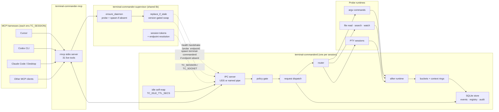
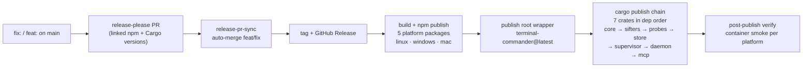

# Terminal Commander

Terminal Commander is a local MCP control plane for coding agents. It gives
Cursor, Codex CLI, Claude Code, Claude Desktop, and other MCP clients a bounded
tool surface for commands, files, PTYs, runtime state, and signal context.

Raw terminal output stays out of the model transcript. The agent receives
structured events, cursors, counters, and explicit context windows instead.

| It is | It is not |
| --- | --- |
| A local daemon plus MCP stdio adapter | A remote service |
| An argv-first command and file signal channel | A generic shell bridge |
| A harness-config writer for MCP clients | A hidden npm bootstrapper |
| A bounded JSON tool surface for LLMs | A human terminal UI |
| **One daemon per harness** (per-`TC_SESSION` isolation) | A single shared multi-tenant daemon |

Latest release: [GitHub Releases](https://github.com/special-place-ai-heaven/terminal-commander/releases/latest) and [npm `latest`](https://www.npmjs.com/package/terminal-commander).

## Quick Start

Install from npm:

```powershell
npm install -g terminal-commander@latest
```

The npm install is intentionally passive:

- no `postinstall` bootstrap
- no MCP config writes
- no daemon start
- no WSL install
- no shell wrapper
- no hidden-window helper spawn

Configure detected harnesses explicitly:

```powershell
terminal-commander setup harness
```

Or target one harness:

```powershell
terminal-commander setup harness --provider cursor
terminal-commander setup harness --provider codex-cli
terminal-commander setup harness --provider claude-code
terminal-commander setup harness --provider claude-desktop
```

`setup harness` mints a stable, distinct **`TC_SESSION`** token per provider and
writes it into each harness's MCP server stanza. Each harness gets its own
daemon endpoint (a per-token Windows named pipe or unix socket); two harnesses
on one machine never share a daemon.

Verify:

```powershell
terminal-commander doctor harness
terminal-commander doctor daemon
terminal-commander session list
terminal-commander --version
```

When a harness starts `terminal-commander-mcp`, the MCP adapter resolves the
endpoint from the inherited `TC_SESSION` (or `TC_SOCKET` override), then uses
local IPC to talk to `terminal-commanderd`. If the daemon is not already
running, the adapter spawns its own session daemon and reports the result on
stderr.

## Per-Harness Sessions

Each harness gets a distinct daemon, keyed by an opaque token. The token is
minted by `setup harness` (deterministic per harness id + machine) and emitted
as `env.TC_SESSION` in the harness's MCP stanza.

**Endpoint resolution precedence** (in both the daemon at bind time and every
client at connect time):

1. `TC_SOCKET` (full path/pipe override — operator escape hatch)
2. `TC_SESSION` (opaque token; ASCII `[A-Za-z0-9._-]`, 1–64 chars, ≥1 alphanumeric, `default` reserved)
3. Per-user default (byte-identical to pre-session behavior; one shared daemon)

Malformed `TC_SESSION` falls back to the per-user default with a stderr
warning — it never names a kernel object.

**On idle, the daemon self-reaps.** Each daemon tracks last-IPC time in memory
and exits gracefully after `TC_IDLE_TTL_SECS` of no real IPC (default 1800
seconds; `0` disables). Health/probe peeks never reset the idle clock. The
shutdown path stops accepting new connections, drains in-flight requests, then
exits 0 and removes the pidfile.

**Windows → WSL forwarding.** When the Windows MCP shim re-execs the Linux MCP
inside WSL, the bridge rebuilds `WSLENV` from a TC-only allowlist
(`TC_SESSION/u`); ambient `WSLENV` entries are dropped to prevent forwarding
operator credentials like `WSL_SUDO_CREDENTIAL`.

**Inspect and reap sessions:**

```powershell
terminal-commander session list
terminal-commander session reap <token>
terminal-commander session reap --all
```

`session reap` sends a graceful `Shutdown` over IPC and waits for the endpoint
to go unreachable. If a daemon is **wedged** (no `ShutdownAck` AND the endpoint
still answers after the wait), it falls back to force-kill. The force path is
**identity-gated by `pid_belongs_to_daemon`** (matches daemon image + session
`state_dir` in the live cmdline) before `hard_kill`, and on Unix is re-checked
**again immediately before the SIGKILL leg** after the ~800 ms grace
(`HardKillOutcome::IdentitySkipped` when the PID was recycled mid-grace). The
force signal is withheld in that case; `reap` exits with the `RefusedNonDaemon`
message rather than killing an unrelated process.

`doctor harness` prints one line per provider plus a `WARNING: shared daemon
mode …` line when ≥2 harnesses are detected and ≥1 is not yet configured by
`setup harness`.

## Update

Update the npm-managed install:

```powershell
terminal-commander update
```

`terminal-commander update` runs the same public npm install command:

```powershell
npm install -g terminal-commander@latest
```

On Windows, update first runs a native preflight that terminates only these
Terminal Commander binaries when their executable path is inside the current
npm platform package `bin` directory:

- `terminal-commander.exe`
- `terminal-commanderd.exe`
- `terminal-commander-mcp.exe`

It does not call `cmd.exe`, PowerShell, `taskkill`, hidden windows, broad
process-name matches, or downloaded helper scripts.

`terminal-commander --version` prints the installed version and, when npm is
reachable quickly, prints a one-line update notice if a newer release exists.

## Commands On PATH

| Command | Role |
| --- | --- |
| `terminal-commander` | Admin CLI: status, doctor, setup, session, rules, buckets, jobs, probes, policy, audit, update |
| `terminal-commander-mcp` | MCP stdio adapter launched by Cursor/Codex/Claude |
| `terminal-commanderd` | Local daemon for IPC, probes, policy, buckets, audit, and graceful shutdown |

Admin CLI subcommands (`terminal-commander <cmd>`):

| Subcommand | Purpose |
| --- | --- |
| `status` | High-level daemon status (reachable / unavailable). |
| `doctor harness` | Per-provider detection + configuration audit (warns on shared-daemon mode). |
| `doctor daemon` | Native daemon diagnostics (binary, pidfile, endpoint). |
| `doctor wsl` | WSL distro + runtime diagnostics. |
| `setup harness [--provider <id>] [--force]` | Write MCP stanzas (mint + emit `env.TC_SESSION`). |
| `setup daemon-autostart` | Install Linux/WSL daemon autostart (systemd/profile). |
| `session list` | Enumerate sessions (default + seeded), columns: SESSION/PID/STATE/IDLE/ENDPOINT. |
| `session reap [<token>] [--all] [--idle --idle-secs N]` | Graceful Shutdown-IPC; identity-gated force fallback. |
| `rules { list \| show <id> }`, `buckets { list \| show <id> }`, `jobs`, `probes`, `policy`, `audit [--limit N]` | Daemon-backed inspection (exit 69 when daemon unavailable; no fake data). |
| `update` | Run `npm install -g terminal-commander@latest` after a scoped Windows lock preflight. |

## Platform Support

| Platform | Package | IPC | Notes |
| --- | --- | --- | --- |
| Linux x64 | `@terminal-commander/linux-x64` | Unix domain socket | Native daemon and MCP adapter |
| Linux arm64 | `@terminal-commander/linux-arm64` | Unix domain socket | Native daemon and MCP adapter |
| Windows x64 | `@terminal-commander/windows-x64` | Named pipe | Native by default |
| macOS x64 | `@terminal-commander/mac-x64` | Unix domain socket | Native package published |
| macOS arm64 | `@terminal-commander/mac-arm64` | Unix domain socket | Native package published |

The legacy Windows-to-WSL bridge is still available for operators who explicitly
set `TC_USE_LEGACY_WSL_BRIDGE=1`. It is not the default Windows path. When the
bridge is used, only `TC_SESSION/u` crosses into WSL via `WSLENV`; the ambient
operator `WSLENV` is dropped.

## Architecture



The MCP adapter does not spawn arbitrary commands and does not open network
sockets. It forwards tool calls to the daemon over local IPC. The daemon applies
policy before starting argv commands or returning bounded file/context data.

Bring-up lives in the shared `terminal-commander-supervisor` crate (used by
the MCP adapter, admin CLI, and daemon `update` mode). On startup the adapter
calls `ensure_daemon`, then `replace_if_stale` when spawn is allowed — a running
daemon older than the installed adapter is swapped before tool calls proceed.

`probe_endpoint` performs a bounded `health` IPC handshake, not a bare connect.
A pre-bound or stale socket that does not answer with our protocol is rejected;
`ensure_daemon` may spawn a fresh session daemon instead.

## How LLMs Should Use It

Use Terminal Commander when raw terminal scrollback would waste context or hide
the signal.

Recommended tool flow:

```text
system_discover
command_start_combed argv=["npm","test"]
bucket_wait bucket_id=<from command_start_combed> cursor=0 timeout_ms=10000
event_context probe_id=<event.probe_id> anchor=<event.anchor> before=20 after=40
command_status job_id=<from command_start_combed>
```

Agent rules:

- Prefer `command_start_combed` for noninteractive commands.
- Use `bucket_wait` instead of polling raw stdout.
- Use `event_context` only when an event pointer needs surrounding text.
- Use `command_status` for exit code, lifecycle state, and counters.
- Use `command_output_tail` for one-off/exploratory commands where you don't
  know what to grep for yet — bounded to 200 lines / 64 KiB, truncation-flagged.
- Do not ask for unbounded output. Every response is intentionally capped.

## MCP Tool Surface

`system_discover` advertises the live tool catalogue: **31 live tools** today,
grouped by use. All daemon-backed tools return a structured `daemon_unavailable`
error when the daemon is down instead of leaking raw pipe/socket errors.

| Group | Tools |
| --- | --- |
| Discovery and health | `system_discover`, `health`, `policy_status`, `self_check` |
| Commands | `command_start_combed`, `command_status`, `command_output_tail` |
| Buckets and context | `bucket_wait`, `bucket_events_since`, `bucket_summary`, `event_context` |
| Rule registry | `registry_search`, `registry_get`, `registry_upsert`, `registry_test`, `registry_activate`, `registry_import_pack`, `registry_deactivate`, `registry_list_active` |
| Files | `file_read_window`, `file_search`, `file_watch_start`, `file_watch_stop`, `file_watch_list` |
| PTY | `pty_command_start`, `pty_command_write_stdin`, `pty_command_stop`, `pty_command_list` |
| Runtime | `runtime_state`, `probe_status`, `probe_list` |

Full contract: [`docs/mcp/TOOL_CONTROL_SURFACE.md`](docs/mcp/TOOL_CONTROL_SURFACE.md).

Discovery is the source of truth for availability. `system_discover` returns
`daemon_available` plus per-tool `requires_daemon`, `available`, and
`unavailable_reason`. It remains callable when the daemon is down.

`health` is a non-bumping, audit-free **peek**: it returns `uptime_secs` plus
optional `idle_secs` and never resets the daemon's idle timer or writes an
audit row. All other IPC requests bump the idle clock and audit normally.

## Harness Configuration

`terminal-commander setup harness` detects installed harnesses and writes MCP
config for supported providers, minting a per-harness `TC_SESSION`. Use
`--provider` to restrict the write.

| Harness | Server key | Config style | Status |
| --- | --- | --- | --- |
| Cursor | `terminal-commander` | JSON `mcpServers` | Live |
| Codex CLI | `terminal_commander` | TOML `[mcp_servers.terminal_commander]` | Live |
| Claude Code | `terminal_commander` | JSON `mcpServers` | Live |
| Claude Desktop | `terminal_commander` | JSON `mcpServers` | Live |
| Gemini | `terminal_commander` | Stub | Path verification pending |
| Kimi | `terminal_commander` | Stub | Path verification pending |

Generated Cursor stanza (with per-harness session token):

```json
{
  "mcpServers": {
    "terminal-commander": {
      "type": "stdio",
      "command": "terminal-commander-mcp",
      "args": [],
      "env": {
        "TC_SESSION": "tc-<12 hex chars>"
      }
    }
  }
}
```

Re-running `setup harness` for the same provider produces the same token (the
mint is deterministic per harness id + machine); your daemon is not churned.
A malformed token in the stanza is rejected at write time by both the JS
validator and the Rust resolver — it never reaches the daemon.

Guides:

- [`docs/integrations/cursor.md`](docs/integrations/cursor.md)
- [`docs/integrations/codex-cli.md`](docs/integrations/codex-cli.md)
- [`docs/integrations/claude-code.md`](docs/integrations/claude-code.md)
- [`docs/integrations/README.md`](docs/integrations/README.md)

## Doctor And Repair

Diagnostics:

```powershell
terminal-commander doctor harness
terminal-commander doctor daemon
terminal-commander doctor wsl
terminal-commander session list
```

`doctor harness` warns "shared daemon mode" when multiple harnesses are present
and at least one is not yet configured. A fully-configured multi-harness
install gets no nag.

Repair is explicit. There is no hidden auto-repair during npm install.

```powershell
terminal-commander setup harness --force
terminal-commander setup daemon-autostart
terminal-commander session reap --all
```

`setup daemon-autostart` is for Linux/WSL operators who want the daemon at
the user's default endpoint to survive reboots. It is independent of the
per-session daemons each MCP spawns; the autostart daemon serves only the
default endpoint and is harmless to session-keyed harnesses.

The Rust admin CLI does not synthesize fake daemon data. Daemon-backed
inspection commands that are not wired to live daemon IPC exit `69` with an
`unavailable` message rather than returning empty or not-found success.

## Safety Posture

- npm install is passive.
- Wrapper scripts use direct process spawn with `shell:false`.
- Windows JS runtime helpers do not request hidden subprocess windows.
- The MCP adapter speaks stdio and local IPC only.
- The daemon uses Unix domain sockets on Unix and named pipes on Windows.
- Command execution is argv-first and policy-gated.
- Tool responses are bounded JSON, not raw stream dumps.
- Config writes are explicit setup commands with atomic writes/backups where
  the provider writer supports them.
- Windows update lock handling is scoped to Terminal Commander binaries inside
  the current npm platform package directory.
- **`ensure_daemon` requires a real Health handshake** — a connectable but
  non-Terminal-Commander socket/pipe (squatter, stale bind, wrong process) is
  rejected, not silently accepted.
- **Force-kill on reap is identity-gated at both signal legs**
  (`pid_belongs_to_daemon` matches daemon image + session `state_dir` from the
  running cmdline). The gate runs before `hard_kill`, and on Unix is re-checked
  immediately before SIGKILL after the ~800 ms grace. If the PID is recycled
  mid-grace, the force signal (`SIGKILL` / `taskkill /F`) is withheld and
  `reap` reports `RefusedNonDaemon` instead of killing an unrelated process.
  The same identity gate is applied by `replace_if_stale` before any force
  attempt.
- **Win→WSL forwarding is a TC-only allowlist** (`TC_SESSION/u`). Ambient
  `WSLENV` is dropped so credential-shaped vars like `WSL_SUDO_CREDENTIAL`
  cannot cross the trust boundary.
- **Daemon idle self-reap** reclaims abandoned daemons without an external
  watcher; the same path drains in-flight requests gracefully before exit.

Security model: [`docs/security/PRIVILEGE_MODEL.md`](docs/security/PRIVILEGE_MODEL.md) and [`SECURITY.md`](SECURITY.md).

## Release Flow

Conventional commits on `main` drive releases through release-please and GitHub
Actions.



| Commit type | Release effect |
| --- | --- |
| `fix:` | Patch release |
| `feat:` | Feature release |
| `docs:`, `chore:`, `ci:` | No release unless configured otherwise |

Details: [`docs/release/release-please-contract.md`](docs/release/release-please-contract.md).

## Develop From Source

```powershell
git clone https://github.com/special-place-ai-heaven/terminal-commander.git
cd terminal-commander
```

Useful checks:

```powershell
cargo fmt --all --check
cargo clippy --workspace --all-targets -- -D warnings
cargo test -p terminal-commander-cli
node --test packages/terminal-commander/test/*.test.js
```

The unix-gated daemon integration tests run on WSL/Linux:

```bash
cargo test -p terminal-commanderd --features test-util
```

Local package testing:

```powershell
cd packages/terminal-commander
npm link
terminal-commander --version
terminal-commander setup --help
terminal-commander session list
```

E2E smoke (Windows, real binaries, isolated TC_DATA, self-cleaning):

```powershell
scripts/smoke/verify-session-isolation-smoke.ps1
```

Testing doctrine: [`TESTING.md`](TESTING.md).

## Repository Layout

```text
crates/                                  Rust workspace (8 crates; 7 published to crates.io)
  core/                                  ids, buckets, context rings, events, activation
  sifters/                               rule evaluation + noise dedupe
  probes/                                process / file / PTY probe runtimes
  store/                                 SQLite (events, registry, audit) + FTS5
  supervisor/                            ensure_daemon, replace_if_stale, session tokens, pidfile
  daemon/                                terminal-commanderd — IPC, policy, router, runtimes
  mcp/                                   terminal-commander-mcp — rmcp stdio, 31-tool catalogue
  cli/                                   terminal-commander admin CLI (local only, not on crates.io)
packages/
  terminal-commander/                    npm root wrapper (@latest)
  terminal-commander-linux-x64/          @terminal-commander/linux-x64
  terminal-commander-linux-arm64/        @terminal-commander/linux-arm64
  terminal-commander-windows-x64/        @terminal-commander/windows-x64
  terminal-commander-mac-x64/            @terminal-commander/mac-x64
  terminal-commander-mac-arm64/          @terminal-commander/mac-arm64
docs/                                    architecture, integrations, release docs
examples/provider-harness/               copy-paste MCP config examples
scripts/                                 CI, release, and smoke helpers
```

## Current Status

| Area | Status |
| --- | --- |
| Native npm install for Linux, Windows, and macOS | Live |
| Passive install with no lifecycle bootstrap | Live |
| Explicit `terminal-commander setup harness` (mints + emits `env.TC_SESSION`) | Live for Cursor, Codex CLI (TOML env block: follow-up), Claude Code, Claude Desktop |
| Per-harness daemon isolation (per-`TC_SESSION` endpoint) | Live |
| Idle daemon self-reap (`TC_IDLE_TTL_SECS`, default 1800, 0=off) | Live |
| `terminal-commander session list` / `session reap` | Live (`session list` shows per-session idle; `session reap` selectors: `<TOKEN>` / `--all` / `--idle <SECS>`) |
| Liveness handshake on probe (rejects squatters) | Live |
| WSL `WSLENV` TC-only allowlist (drops ambient) | Live |
| `doctor harness` shared-daemon-mode warning | Live |
| Gemini and Kimi `setup harness` | Stub only until config paths are verified |
| MCP stdio adapter and daemon auto-ensure | Live (31-tool catalogue) |
| Local IPC | UDS on Unix, named pipe on Windows; per-session endpoints |
| `terminal-commander update` | Live; Windows lock preflight is native and scoped |
| Legacy Windows-to-WSL bridge | Opt-in with `TC_USE_LEGACY_WSL_BRIDGE=1` |

## License

Apache-2.0. See [`LICENSE`](LICENSE).
