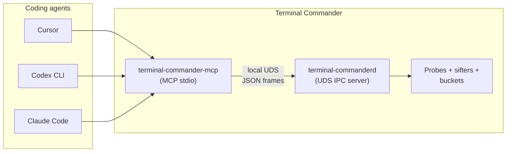
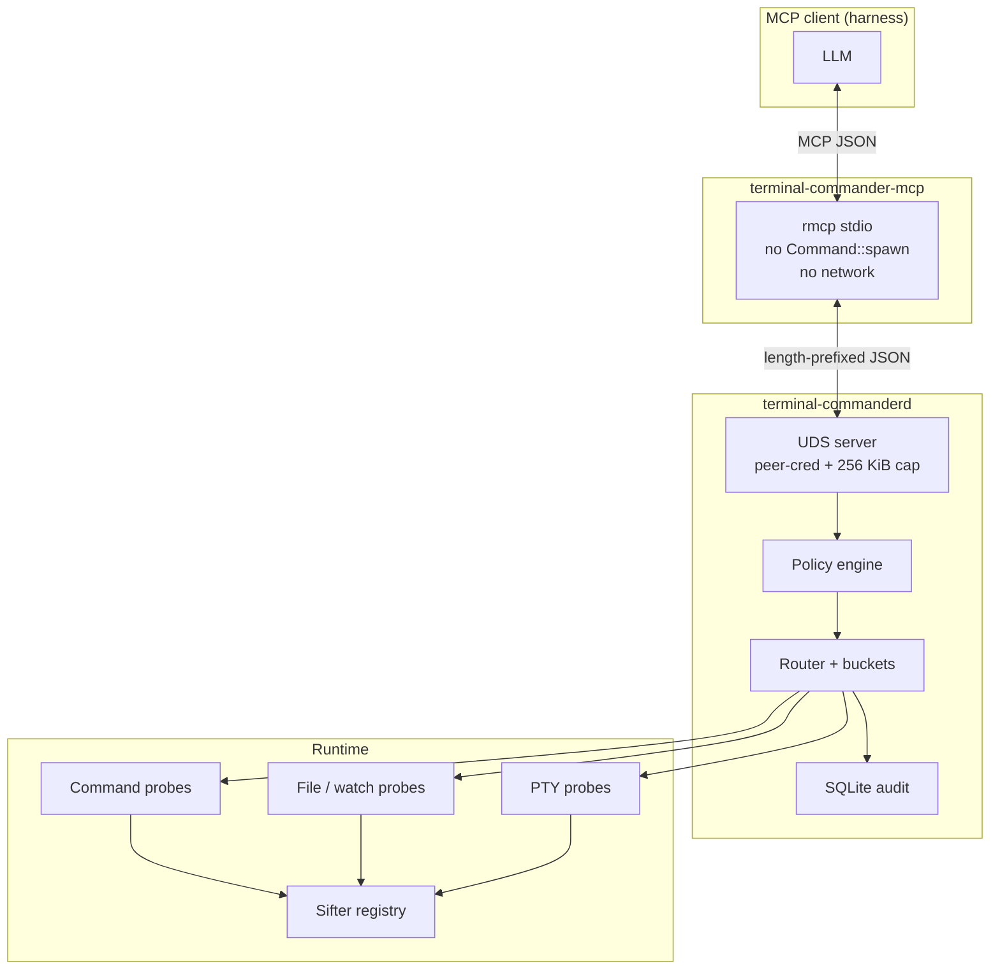
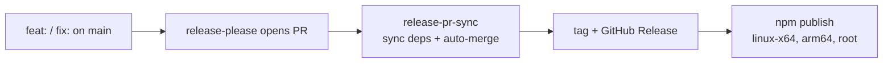

# Terminal Commander

**Local MCP control plane for coding agents** — Cursor, Codex CLI, Claude Code, and other harnesses. Terminal Commander runs on your machine, turns terminal / file / PTY noise into **bounded structured signal**, and exposes it through MCP tools so the model never has to parse raw scrollback.

```text
Raw terminal / file / PTY output goes in.
Only vetted, structured signal comes out.
Context stays available by pointer.
```

| It is | It is not |
|-------|-----------|
| An MCP tool surface for LLMs | A human-facing terminal UI |
| A local daemon + probes + sifters | A remote service or log shipper |
| argv-only command control (policy-gated) | A generic shell bridge |

**Latest release:** [`v0.1.8`](https://github.com/special-place-ai-heaven/terminal-commander/releases/latest) on [npm `latest`](https://www.npmjs.com/package/terminal-commander).

---

## Who this is for

Terminal Commander is **harness-first**. The primary user is the **coding agent** inside your editor or CLI harness. Humans typically run **one install command**, then an explicit `setup harness` command, and use `doctor` only when something fails.



---

## Install

Install from npm:

```powershell
npm install -g terminal-commander@latest
```

The npm install is passive. It installs the Node launcher plus the matching
platform optional dependency; it does not run lifecycle bootstrap, write MCP
configs, install inside WSL, or start daemons.

Update explicitly:

```powershell
terminal-commander update
```

This runs:

```powershell
npm install -g terminal-commander@latest
```

`terminal-commander --version` prints the installed version and, when npm can be
reached quickly, reports when a newer npm release is available.

### Configure harnesses

Run setup explicitly after install or update:

```sh
terminal-commander setup harness --provider cursor
terminal-commander setup harness --provider codex-cli
terminal-commander setup harness --provider claude-code
terminal-commander setup harness --provider claude-desktop
```

Omit `--provider` to configure every detected harness. On Windows, setup may
install the Linux runtime inside the selected WSL distro and configure daemon
autostart. This is an explicit operator command, not an npm lifecycle side
effect.

### Commands on `PATH`

| Command | Role |
|---------|------|
| `terminal-commander-mcp` | MCP stdio adapter |
| `terminal-commanderd` | Daemon — probes, policy, buckets, audit |
| `terminal-commander` | Doctor / diagnostics CLI |

---

## Architecture



**Windows note:** Cursor/Codex/Claude on Windows invoke `terminal-commander-mcp`
on the host. The default path uses the Windows x64 platform package. The legacy
WSL bridge remains available behind `TC_USE_LEGACY_WSL_BRIDGE=1` for operators
who still want the Linux runtime path.

**Platforms:**

| Surface | Linux / WSL2 | Windows host |
|---------|----------------|--------------|
| Daemon + UDS | Yes | No (runs in WSL) |
| MCP stdio | Native | Bridge to WSL |
| npm package | Passive launcher + platform optional dependency | Passive launcher + platform optional dependency |
| setup | Explicit harness + autostart setup | Explicit WSL runtime + harness + autostart setup |

Prebuilt npm platform packages are published for Linux x64/arm64, Windows x64,
and macOS x64/arm64.

Deeper docs: [`docs/runtime/REALTIME_SIGNAL_CHANNEL.md`](docs/runtime/REALTIME_SIGNAL_CHANNEL.md), [`docs/runtime/UDS_IPC.md`](docs/runtime/UDS_IPC.md), [`docs/mcp/TOOL_CONTROL_SURFACE.md`](docs/mcp/TOOL_CONTROL_SURFACE.md).

---

## Signal model

- **Probes** observe commands, files, PTY streams, and runtime state.
- **Sifters** + **registry rules** turn raw lines into typed events (errors, stalls, prompts, artifacts, …).
- **Buckets** expose cursor-based, bounded event streams to the LLM.
- **`bucket_wait`** parks until matching signal or a heartbeat timeout — never raw stdout text in the transcript.
- **`event_context`** returns a bounded window around a pointer when the model asks for more context.

---

## Harness configuration

After install or update, run `terminal-commander setup harness` explicitly to
write MCP config. The package install itself never mutates harness config.

| Harness | Config location | Setup support |
|---------|-----------------|-----------------|
| Cursor | `~/.cursor/mcp.json` (or project `.cursor/mcp.json`) | `terminal-commander setup harness --provider cursor` |
| Codex CLI | `~/.codex/config.toml` -> `[mcp_servers.terminal_commander]` | `terminal-commander setup harness --provider codex-cli` |
| Claude Code | `~/.claude.json` -> `mcpServers` | `terminal-commander setup harness --provider claude-code` |
| Claude Desktop | `%AppData%\Claude\claude_desktop_config.json` (Windows) | `terminal-commander setup harness --provider claude-desktop` |

**Generated Cursor stanza (Windows bridge):**

```json
{
  "mcpServers": {
    "terminal-commander": {
      "type": "stdio",
      "command": "terminal-commander-mcp",
      "env": {
        "TC_WSL_DISTRO": "Ubuntu-24.04"
      }
    }
  }
}
```

Pin a distro with `TC_WSL_DISTRO` or let the bridge pick the `wsl -l -v` default.

Guides: [`docs/integrations/cursor.md`](docs/integrations/cursor.md), [`docs/integrations/codex-cli.md`](docs/integrations/codex-cli.md), [`docs/integrations/claude-code.md`](docs/integrations/claude-code.md).

Copy-paste examples: [`examples/provider-harness/cursor/`](examples/provider-harness/cursor/).

---

## Daemon lifecycle

On Linux/WSL, explicit setup configures autostart. You should **not** need a
manual `terminal-commanderd start` for normal harness use after setup.

| Mechanism | When |
|-----------|------|
| systemd user service | WSL/Linux with systemd (common on Ubuntu 24.04 WSL) |
| `~/.config/terminal-commander/autostart.sh` | Profile hook + first MCP bridge connect |
| MCP bridge | Sources autostart before spawning MCP |

**Manual start** (debugging only):

```sh
export TC_DATA="${HOME}/.local/share/terminal-commanderd"
mkdir -p "$TC_DATA"
terminal-commanderd --data-dir "$TC_DATA" start --mode ipc-server
```

Default socket: `$TC_DATA/terminal-commanderd.sock` (override with `TC_SOCKET` in harness env if needed).

---

## Diagnostics

```powershell
# Windows
terminal-commander doctor harness          # detected vs configured MCP
terminal-commander doctor wsl --probe-runtime
terminal-commander doctor daemon         # socket + autostart (0.1.4+)
```

```sh
# Linux / inside WSL
terminal-commander doctor harness
terminal-commander doctor daemon
```

Repair helpers (rare):

```powershell
terminal-commander setup harness --force   # rewrite harness MCP stanzas
terminal-commander setup daemon-autostart   # reinstall autostart unit/hook
```

---

## MCP tools (29)

Representative tools:

```text
health                      system_discover           policy_status
command_start_combed        command_status            bucket_wait
bucket_events_since         bucket_summary            event_context
file_read_window            file_search               file_watch_*
pty_command_*               registry_*                runtime_state / probe_*
```

Full catalogue with bounds and policy gates: [`docs/mcp/TOOL_CONTROL_SURFACE.md`](docs/mcp/TOOL_CONTROL_SURFACE.md).

**Example agent flow:**

```text
command_start_combed  argv=["echo","hello"]
bucket_wait           bucket_id=<from_combed>  cursor=0  timeout_ms=5000
command_status        job_id=<from_combed>
```

Every response is bounded JSON — no raw stream dump in the model context.

---

## Releases (fully automated)

Pushing **Conventional Commits** to `main` drives shipping — no manual release PR merge:



| Commit type | Version bump |
|-------------|--------------|
| `feat:` | minor (pre-1.0 patch semantics via release-please config) |
| `fix:` | patch |
| `chore:`, `docs:`, `ci:` | no release |

The `ensure-release` job backstops tag/GitHub Release/npm if release-please skips a step — operators should **not** hand-tag or run `force_publish` for normal releases.

Details: [`docs/release/release-please-contract.md`](docs/release/release-please-contract.md).

---

## Configuration

Example daemon config: [`config/terminal-commanderd.example.toml`](config/terminal-commanderd.example.toml).

| Setting | Notes |
|---------|--------|
| `daemon.data_dir` | SQLite + socket; must be native Linux fs (not WSL `/mnt/c`) |
| `daemon.socket_path` | Default `<data_dir>/terminal-commanderd.sock` |
| `policy.profile` | `developer_local`, `repo_only`, `read_only_observer`, `admin_debug` |

| Environment | Purpose |
|-------------|---------|
| `TC_SOCKET` | MCP adapter UDS path override |
| `TC_WSL_DISTRO` | Pin WSL distro for Windows bridge |
| `TC_SKIP_BOOTSTRAP` | Skip install/bootstrap |
| `TC_SKIP_DAEMON_AUTOSTART` | Skip daemon service/profile install |

---

## Safety posture

- **No MCP command spawn** — `terminal-commander-mcp` only speaks MCP + UDS.
- **No network listeners** — local Unix socket only, peer credentials checked.
- **No raw stream tools** — bounded JSON envelopes only.
- **Policy before spawn** — argv-only starts; shell interpreters denied by default.
- **PTY stdin guard** — secret-prompt patterns rejected on `pty_command_write_stdin`.
- **Persistent audit** — SQLite `audit_records` with closed decision labels.

[`docs/security/PRIVILEGE_MODEL.md`](docs/security/PRIVILEGE_MODEL.md) · [`SECURITY.md`](SECURITY.md)

---

## Develop from source

```sh
git clone https://github.com/special-place-ai-heaven/terminal-commander.git
cd terminal-commander

cargo fmt --all --check
cargo clippy --workspace --all-targets -- -D warnings
cargo nextest run --workspace

bash scripts/smoke/verify-runtime-smoke.sh
bash scripts/smoke/verify-npm-local-install.sh

# Windows bridge smoke (on Windows host)
pwsh -File scripts/smoke/verify-windows-bridge-smoke.ps1
```

Link local package for testing bootstrap changes:

```powershell
cd packages/terminal-commander
npm link
npm install -g terminal-commander@latest   # when testing published bits
```

Testing doctrine: [`TESTING.md`](TESTING.md).

---

## Repository layout

```text
crates/          Rust workspace (daemon, mcp, core, probes, store, …)
packages/        npm: terminal-commander + linux-x64 + linux-arm64
packages/terminal-commander/lib/
  bootstrap/     install + lazy MCP bootstrap
  wsl/           Windows → WSL bridge
  harness/       multi-provider MCP config writers
  daemon/        autostart install
docs/            runtime, MCP, integrations, release contracts
examples/        provider-harness copy-paste configs
scripts/smoke/   runtime, npm, Windows bridge verification
```

---

## Status

| Area | State |
|------|--------|
| Daemon + UDS IPC + 29 MCP tools | Live |
| npm `terminal-commander@0.1.4` on `latest` | Live |
| Windows native install | In progress (see `docs/adr/ADR-native-tier1-runtime.md`) |
| Harness auto-config + daemon autostart | Live |
| Automated release + npm publish | Live |
| macOS / native Windows daemon | Not planned (WSL path on Windows) |

---

## License

Apache-2.0 — see [`LICENSE`](LICENSE).
