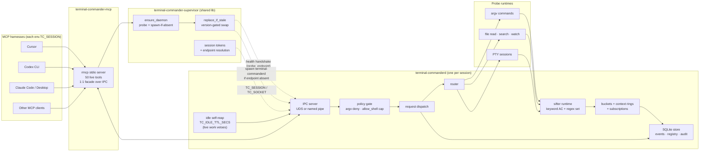
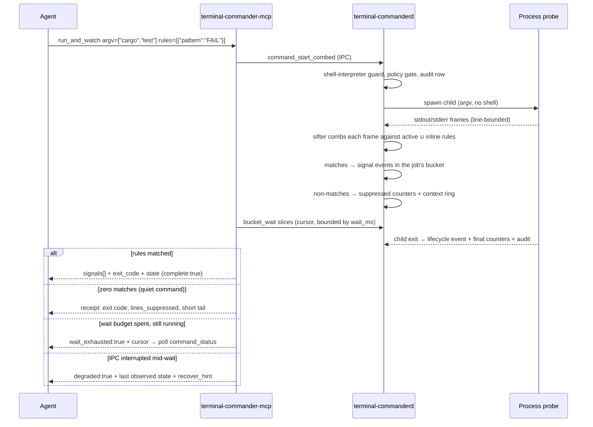

<div align="center">


# Terminal Commander

**Structured terminal signals for AI coding agents — bounded receipts, never silence, local-first.**

[](https://www.npmjs.com/package/terminal-commander)
[](https://github.com/special-place-ai-heaven/terminal-commander/actions/workflows/npm-binary-build.yml)
[](./LICENSE)
[](./rust-toolchain.toml)
[](https://modelcontextprotocol.io)
[](#platform-support)

[Install](#quick-start) · [Why](#why-terminal-commander) · [How It Works](#architecture) · [Tools](#mcp-tool-surface) · [Innovations](#innovations)

</div>

---

Terminal Commander is a local MCP control plane for coding agents. It gives
Cursor, Codex CLI, Claude Code, Claude Desktop, and other MCP clients a bounded
tool surface for commands, files, PTYs, persistent shell sessions, runtime
state, and signal context.

The goal is **omni**: an agent should never need a separate raw terminal tool.
Across the omni program the surface grew to **49 MCP tools** spanning one-shot
commands, one-shot shell pipelines, persistent stateful sessions, interactive
PTYs (unix and Windows ConPTY), unknown-output rule suggestion, and
operator-gated remote hosts. The agent's lane-selection map is
[`docs/mcp/OMNI_PLAYBOOK.md`](docs/mcp/OMNI_PLAYBOOK.md).

Raw terminal output stays out of the model transcript. The agent defines
keyword/regex **rules**, runs the command, and receives only the matching
**signal events** plus the exit state. A quiet command (zero matches) returns a
bounded **receipt** — exit code, suppressed-line count, short tail — so no
result is ever silent or misleading.

> [!IMPORTANT]
> The default command lane is **argv-only**: `argv[0]` is the program, shell
> interpreters (`sh`, `bash`, `cmd`, `powershell`, …) are denied, and there is
> no string-concatenated shell anywhere in the path. Pipelines and redirects
> live behind the separate `shell_exec` tool, which is disabled unless the
> operator enables the `allow_shell` policy capability.

## Contents

- [Why Terminal Commander](#why-terminal-commander)
- [Innovations](#innovations)
- [Quick Start](#quick-start)
- [Architecture](#architecture)
- [The Life Of A Command](#the-life-of-a-command)
- [How LLMs Should Use It](#how-llms-should-use-it)
- [MCP Tool Surface](#mcp-tool-surface)
- [Per-Harness Sessions](#per-harness-sessions)
- [Harness Configuration](#harness-configuration)
- [Platform Support](#platform-support)
- [Admin CLI](#admin-cli)
- [Doctor And Repair](#doctor-and-repair)
- [Update](#update)
- [Environment](#environment)
- [Local State](#local-state)
- [Safety Posture](#safety-posture)
- [Release Flow](#release-flow)
- [Develop From Source](#develop-from-source)
- [Repository Layout](#repository-layout)
- [License](#license)

## Why Terminal Commander

Coding agents run terminal commands constantly, and raw terminal output is
hostile to them: unbounded, noisy, and token-expensive. A test suite that
prints 2,802 lines costs a context-window fortune to scroll — when the only
information the agent needed was "exit 0" and five matched lines. That is the
product: in real use, Terminal Commander condensed exactly such a run into a
five-line receipt with the exit code.

| Instead of | Use | Effect |
|---|---|---|
| Reading 2,800 lines of test scrollback | `command_start_combed` + rules + `command_status` | Matched signals + a bounded exit receipt |
| Polling raw stdout in a loop | `bucket_wait` (long-poll with cursor) | Wake on signal, heartbeat on quiet |
| Re-running a command to "see that error again" | `event_context` on the event pointer | Bounded context window around the line |
| `tail -f build.log` in a terminal you can't see | `file_watch_start` + rules | Structured events as lines append |
| One watcher loop per running job | `subscription_open` over many sources | One multiplexed pull for everything |
| Pasting a whole file for one section | `file_read_window` / `file_search` | Bounded windows and match pointers |

Three properties rank above everything else, in this order:

1. **Trust** — every response is honest about state (`running`/`exited`/
   `failed`/degraded), counters are near-real-time and never lie, receipts are
   accurate, and errors teach the caller how to recover.
2. **Reliability** — the daemon self-manages (idle self-reap with live-work
   veto), processes are torn down as whole trees on stop, and degraded states
   are disclosed loudly with a recovery path.
3. **LLM ergonomics** — a fresh model with only the tool schemas succeeds on
   the first call: minimal required fields, defaults that work, lenient
   parameter coercion for real-world MCP clients, and one complete teaching
   error instead of a guessing game.

## Innovations

The engineering decisions that distinguish Terminal Commander from "run a
command over MCP".

### Structured signals over raw streams

Every captured line flows through the **sifter runtime**: an Aho-Corasick pass
for keyword rules and a compiled regex-set pass for pattern rules, one event
per matching rule per frame, with named captures, severity, tags, and a
summary template. The agent reads events, not scrollback. Rules can be passed
inline per command (minimal: `[{"pattern": "ERROR"}]` — everything else has a
sane default), or persisted in a versioned **registry** and activated
globally or scoped to one bucket/job/probe. Activating a new version of a rule
supersedes the old one in that scope, so one line never fires twice.

### Bounded receipts that never go silent

A command whose output matched zero rules is not an error and not an empty
success — it returns a **receipt**: exit code, how many lines were suppressed,
and a short tail. The same no-silence rule runs through the whole surface:
`command_status` for a finished quiet job carries the receipt; a stopped job
reports its real counters (snapshotted from the live probe metrics, not
zeroes); truncation is always flagged (`truncated_lines`, `truncated_bytes`,
`evicted_frames`).

### Degraded-state disclosure with recovery hints

If an IPC error interrupts a `run_and_watch` wait, the response does not
become a bare error — the job handle is preserved and the result arrives with
`degraded: true`, the last observed state, and a `recover_hint` that tells the
agent exactly how to re-attach (`command_status` with the returned `job_id`).
Mutating RPCs are never auto-retried; idempotent ones may be. A daemon restart
is detectable via `boot_id` on subscriptions.

### Buckets, context rings, and subscriptions

Signals land in per-job **buckets** read by cursor (`bucket_events_since`,
`bucket_wait`) so nothing is lost between polls and nothing is re-sent.
Each probe keeps a bounded **context ring** of raw frames so `event_context`
can resolve a pointer into surrounding lines on demand — context is fetched
when needed, never pushed. **Subscriptions** multiplex many sources behind one
predicate (severity floor, kind allowlist, tag, source set) with per-source
liveness in every pull, and `sources: all` auto-joins future probes.

### A thin-facade adapter that cannot surprise you

`terminal-commander-mcp` is a stdio adapter in which every tool forwards 1:1
to a daemon IPC method. CI guards assert the adapter source contains no
process spawn, no network socket, and no direct filesystem access — the policy
gate in the daemon is the single choke point. Tool schemas are typed plainly
(no `["integer","null"]` unions that real MCP clients strip), and parameters
arriving as stringified numbers or JSON-encoded arrays are coerced with
teaching errors — schema honesty for clients that aren't.

### Per-session daemons with disciplined lifecycles

Each harness gets its own daemon keyed by a deterministic `TC_SESSION` token —
two harnesses never share state. An idle daemon self-reaps after
`TC_IDLE_TTL_SECS` (default 1800 s) of no real IPC, but **live work vetoes the
reap**: a still-running command, file watch, or PTY job keeps the daemon up so
children are never orphaned and receipts never lost. `command_stop` kills the
whole process tree, identity-gated so a recycled PID is never signalled.

### Policy gate, audit trail, and the argv-only contract

Every command start passes a policy engine (profile-based: deny lists, path
suffix guards, per-call caps) and emits a durable audit row with
credential-redacted argv. The shell lane (`shell_exec`) is a separate policy
action (`allow_shell`, default off) — enabling it is an explicit operator
decision, never an agent's.

### Rule packs: expert signal extraction in one call

`registry_import_pack` ships **25 curated packs** so an agent gets expert
rules without authoring JSON: `ansible`, `apt`, `bundler`, `cargo`, `choco`,
`cleanup`, `docker`, `dotnet`, `gcc`, `generic.terminal`, `git`, `go`,
`kubectl`, `make`, `msbuild`, `npm`, `pip`, `pnpm`, `pytest`, `ssh`,
`systemd`, `terraform`, `uv`, `winget`, `yarn`. Pack rules label honestly: a
generic `warning:` matcher claims no language it cannot verify. When a known
tool runs without its pack, a command-start response can carry a
`pack_available` hint pointing at `registry_import_pack`.

For output whose format you do not know yet, `registry_suggest_from_samples`
proposes DRAFT rules from raw samples (pure-Rust heuristics). It NEVER
auto-activates: the loop is always suggest -> `registry_test` ->
`registry_upsert` -> `registry_activate`.

> [!TIP]
> Prefer **scoped** activation (`{"kind":"job", "job_id": …}`) or per-command
> inline rules over global activation. Globally-activated rules see every
> command's streams — a `warning:` pattern meant for cargo will also fire on
> git's CRLF notices.

## Quick Start

Install from npm:

```powershell
npm install -g terminal-commander@latest
```

The npm install is intentionally passive: no `postinstall` bootstrap, no MCP
config writes, no daemon start, no WSL install, no shell wrapper, no
hidden-window helper spawn.

Configure detected harnesses explicitly:

```powershell
terminal-commander setup harness
```

Or target one harness:

```powershell
terminal-commander setup harness --provider cursor
terminal-commander setup harness --provider codex-cli
terminal-commander setup harness --provider claude-code
terminal-commander setup harness --provider claude-desktop
```

Verify:

```powershell
terminal-commander doctor harness
terminal-commander doctor daemon
terminal-commander session list
terminal-commander --version
```

When a harness starts `terminal-commander-mcp`, the adapter resolves the
endpoint from the inherited `TC_SESSION` (or `TC_SOCKET` override) and talks
to `terminal-commanderd` over local IPC. If the daemon is not already running,
the adapter spawns its own session daemon and reports the result on stderr.

## Architecture



The MCP adapter does not spawn arbitrary commands and does not open network
sockets — CI guards enforce this on the adapter source. It forwards tool calls
to the daemon over local IPC; the daemon applies policy before starting argv
commands or returning bounded file/context data.

`probe_endpoint` performs a bounded `health` IPC handshake, not a bare
connect. A pre-bound or stale socket that does not answer with our protocol is
rejected; `ensure_daemon` may spawn a fresh session daemon instead.

## The Life Of A Command



> [!NOTE]
> Every branch of that `alt` returns something useful. There is no path where
> a started command yields a bare error that loses the job handle, and no path
> where output disappears without a count of what was suppressed.

## How LLMs Should Use It

Use Terminal Commander when raw terminal scrollback would waste context or
hide the signal.

One-shot (most common):

```text
run_and_watch argv=["npm","test"] rules=[{"pattern": "FAIL"}]
→ signals + exit_code in one call; quiet runs return a receipt
```

Long-running, with live monitoring:

```text
command_start_combed argv=["cargo","nextest","run"] rules=[{"pattern":"^\\s+FAIL"}]
bucket_wait bucket_id=<returned> cursor=0 timeout_ms=10000
command_status job_id=<returned>          # near-real-time counters mid-run
event_context bucket_id=… event_id=…      # surrounding lines for one event
command_output_tail job_id=<returned>     # bounded tail when you don't know what to grep
command_stop job_id=<returned>            # kills the whole process tree
```

Agent rules:

- Prefer `run_and_watch` for commands that finish within a minute; use
  `command_start_combed` + `bucket_wait` for longer jobs.
- A minimal rule is just `{"pattern": "ERROR"}` — id, version, kind, severity,
  and summary default sanely. Severity accepts `error`/`warn`/`fatal` aliases.
- Use `command_output_tail` for exploratory commands where you don't know what
  to match yet — bounded to 200 lines / 64 KiB, truncation-flagged.
- Use `subscription_open` + `subscription_pull` instead of N polling loops
  when watching several jobs at once.
- `wait_exhausted: true` means STILL RUNNING — poll `command_status`; do not
  treat it as finished. `degraded: true` means follow the `recover_hint`.
- Do not ask for unbounded output. Every response is intentionally capped.

## MCP Tool Surface

`system_discover` advertises the live tool catalogue: **50 live tools**,
grouped by workflow. All daemon-backed tools return a structured
`daemon_unavailable` error when the daemon is down instead of leaking raw
pipe/socket errors, and `system_discover` itself remains callable to explain
per-tool availability (`requires_daemon`, `available`, `unavailable_reason`).
When the daemon is reachable it also probes the execution environment with
hard time bounds: OS/architecture, terminal evidence, shell and PowerShell
paths/versions, WSL execution, and core tools. Confirmed interpreters become
ranked `access_routes`; `beachhead` is the highest-ranked route and includes the
exact argv template an LLM can follow. Unavailable or timed-out candidates stay
truthful evidence, never inferred availability. Discovery also carries the
honest `omni_status` capability matrix (see below).

| Group | Tools |
| --- | --- |
| Discovery and health | `system_discover`, `health`, `policy_status`, `self_check` |
| Commands | `run_and_watch`, `command_start_combed`, `command_status`, `command_stop`, `command_output_tail`, `shell_exec` |
| Buckets and context | `bucket_wait`, `bucket_events_since`, `bucket_summary`, `event_context` |
| Subscriptions | `subscription_open`, `subscription_pull`, `subscription_list`, `subscription_close`, `subscription_seek` |
| Rule registry | `registry_search`, `registry_get`, `registry_upsert`, `registry_test`, `registry_activate`, `registry_import_pack`, `registry_deactivate`, `registry_list_active`, `registry_suggest_from_samples` |
| Files | `file_read_window`, `file_search`, `file_write`, `file_watch_start`, `file_watch_stop`, `file_watch_list` |
| PTY | `pty_command_start`, `pty_command_write_stdin`, `pty_command_stop`, `pty_command_list` |
| Shell sessions | `shell_session_start`, `shell_session_exec`, `shell_session_status`, `shell_session_stop`, `shell_session_list` |
| Workspace snapshots | `workspace_snapshot_create`, `workspace_snapshot_apply` |
| Remote targets | `target_list`, `target_probe` |
| Runtime | `runtime_state`, `probe_status`, `probe_list` |

That is 50 tools: discovery/health (4), commands (6), buckets/context (4),
subscriptions (5), registry (9), files (6), PTY (4), shell sessions (5),
workspace snapshots (2), remote targets (2), runtime (3).

Full contract: [`docs/mcp/TOOL_CONTROL_SURFACE.md`](docs/mcp/TOOL_CONTROL_SURFACE.md).
Agent lane-selection map: [`docs/mcp/OMNI_PLAYBOOK.md`](docs/mcp/OMNI_PLAYBOOK.md).

**Omni capability matrix.** `system_discover.omni_status` reports, honestly
from live state, which omni capabilities are wired on THIS host: `shell_exec`,
`sessions` (unix-only), `pty` (with a `platform` of `posix` / `windows_conpty`
/ `unavailable`), `remote_targets` (count + reachable), and `privileged_helper`
-- which is always `{ available: false, reason: "threat_review_pending" }`
because the privileged helper is plan-only (no code shipped; blocked on a
threat review). The matrix never claims a capability that is not actually
wired.

`health` is a non-bumping, audit-free **peek**: it returns `uptime_secs` plus
optional `idle_secs` and never resets the daemon's idle timer or writes an
audit row. All other IPC requests bump the idle clock and audit normally.

> [!WARNING]
> `shell_exec` exists for pipelines/compounds/redirects, but it is gated by
> the `allow_shell` policy capability, which is **off by default** and lives
> in the operator's config TOML — it is not an MCP-flippable parameter. On the
> default profile, `shell_exec` returns `PolicyDenied`.

> [!CAUTION]
> PTY tools are a dual backend: unix `pty-process` and Windows ConPTY
> (`portable-pty`). `system_discover.omni_status.pty.platform` reports the
> live backend (`posix`, `windows_conpty`, or `unavailable`) per host before
> you call. Honest caveat: ConPTY lifecycle is live-verified on Windows, but
> full live ConPTY child-output end-to-end remains gated behind
> `TC_CONPTY_E2E=1` and is not yet closed on every dev host -- check
> `system_discover` on native Windows before relying on it.

> [!TIP]
> Persistent shell sessions (`shell_session_*`) and workspace snapshots
> (`workspace_snapshot_*`) let an agent run multi-step work that shares
> cwd/env. They are gated by `allow_session` (default off) and are UNIX-ONLY;
> on a non-unix daemon they return `UnsupportedPlatform`. See
> [`docs/runtime/SHELL_SESSION.md`](docs/runtime/SHELL_SESSION.md).

## Per-Harness Sessions

Each harness gets a distinct daemon, keyed by an opaque token. The token is
minted by `setup harness` (deterministic per harness id + machine) and emitted
as `env.TC_SESSION` in the harness's MCP stanza.

**Endpoint resolution precedence** (in both the daemon at bind time and every
client at connect time):

1. `TC_SOCKET` (full path/pipe override — operator escape hatch)
2. `TC_SESSION` (opaque token; ASCII `[A-Za-z0-9._-]`, 1–64 chars, ≥1 alphanumeric, `default` reserved)
3. Per-user default (one shared daemon)

Malformed `TC_SESSION` falls back to the per-user default with a stderr
warning — it never names a kernel object.

**On idle, the daemon self-reaps.** Each daemon tracks last-IPC time in memory
and exits gracefully after `TC_IDLE_TTL_SECS` of no real IPC (default 1800
seconds; `0` disables). Health/probe peeks never reset the idle clock.
**Live work defers the reap**: a still-running command, file watch, or PTY job
keeps the daemon alive so children are never orphaned and their receipts,
exit events, and audit rows are never lost. The shutdown path stops accepting
new connections, drains in-flight requests, then exits 0 and removes the
pidfile.

**Inspect and reap sessions:**

```powershell
terminal-commander session list
terminal-commander session reap <token>
terminal-commander session reap --all
```

`session reap` sends a graceful `Shutdown` over IPC and waits for the endpoint
to go unreachable. If a daemon is wedged, the force path is identity-gated by
`pid_belongs_to_daemon` (daemon image + session `state_dir` in the live
cmdline) before any kill signal, and on Unix is re-checked again immediately
before the SIGKILL leg — a PID recycled mid-grace is never signalled.

## Harness Configuration

`terminal-commander setup harness` detects installed harnesses and writes MCP
config for supported providers, minting a per-harness `TC_SESSION`. Use
`--provider` to restrict the write.

| Harness | Server key | Config style | Status |
| --- | --- | --- | --- |
| Cursor | `terminal-commander` | JSON `mcpServers` | Live |
| Codex CLI | `terminal_commander` | TOML `[mcp_servers.terminal_commander]` | Live |
| Claude Code | `terminal_commander` | JSON `mcpServers` | Live |
| Claude Desktop | `terminal_commander` | JSON `mcpServers` | Live |
| Gemini | `terminal_commander` | Stub | Path verification pending |
| Kimi | `terminal_commander` | Stub | Path verification pending |

Generated Cursor stanza (with per-harness session token):

```json
{
  "mcpServers": {
    "terminal-commander": {
      "type": "stdio",
      "command": "terminal-commander-mcp",
      "args": [],
      "env": {
        "TC_SESSION": "tc-<12 hex chars>"
      }
    }
  }
}
```

Re-running `setup harness` for the same provider produces the same token; your
daemon is not churned. A malformed token in the stanza is rejected at write
time by both the JS validator and the Rust resolver.

Guides: [`docs/integrations/cursor.md`](docs/integrations/cursor.md) ·
[`docs/integrations/codex-cli.md`](docs/integrations/codex-cli.md) ·
[`docs/integrations/claude-code.md`](docs/integrations/claude-code.md) ·
[`docs/integrations/README.md`](docs/integrations/README.md)

## Platform Support

| Platform | Package | IPC | Notes |
| --- | --- | --- | --- |
| Linux x64 | `@terminal-commander/linux-x64` | Unix domain socket | Native daemon and MCP adapter |
| Linux arm64 | `@terminal-commander/linux-arm64` | Unix domain socket | Native daemon and MCP adapter |
| Windows x64 | `@terminal-commander/windows-x64` | Named pipe | Native by default; PTY via ConPTY (full child-output e2e gated by `TC_CONPTY_E2E=1`); shell sessions are unix-only |
| macOS x64 | `@terminal-commander/mac-x64` | Unix domain socket | Native package published |
| macOS arm64 | `@terminal-commander/mac-arm64` | Unix domain socket | Native package published |

macOS native packages are published, but the omni platform-parity work for
macOS is code plus a smoke script only -- it is NOT live-verified on a Mac
host (no Mac host available to the program), so treat the macOS runtime as
unverified until a Mac smoke run lands. Likewise, native-Windows ConPTY
child-output e2e is gated behind `TC_CONPTY_E2E=1` and must be run on
CI/desktop to fully close it.

The legacy Windows-to-WSL bridge is still available for operators who
explicitly set `TC_USE_LEGACY_WSL_BRIDGE=1`. It is not the default Windows
path. When the bridge is used, only `TC_SESSION/u` crosses into WSL via
`WSLENV`; the ambient operator `WSLENV` is dropped so credential-shaped vars
cannot cross the trust boundary.

## Admin CLI

| Command | Role |
| --- | --- |
| `terminal-commander` | Admin CLI: status, doctor, setup, session, rules, jobs, probes, policy, audit, update |
| `terminal-commander-mcp` | MCP stdio adapter launched by Cursor/Codex/Claude |
| `terminal-commanderd` | Local daemon for IPC, probes, policy, buckets, audit, and graceful shutdown |

Admin CLI subcommands (`terminal-commander <cmd>`):

| Subcommand | Purpose |
| --- | --- |
| `status` | High-level daemon status (reachable / unavailable). |
| `doctor harness` | Per-provider detection + configuration audit (warns on shared-daemon mode). |
| `doctor daemon` | Native daemon diagnostics (binary, pidfile, endpoint). |
| `doctor wsl` | WSL distro + runtime diagnostics. |
| `setup harness [--provider <id>] [--force]` | Write MCP stanzas (mint + emit `env.TC_SESSION`). |
| `setup daemon-autostart` | Install Linux/WSL daemon autostart (systemd/profile). |
| `session list` | Enumerate sessions (default + seeded), columns: SESSION/PID/STATE/IDLE/ENDPOINT. |
| `session reap [<token>] [--all] [--idle --idle-secs N]` | Graceful Shutdown-IPC; identity-gated force fallback. |
| `rules { list \| show <id> }`, `jobs`, `probes`, `policy`, `audit [--limit N]` | Daemon-backed inspection (exit 69 when daemon unavailable; no fake data). |
| `update` | Run `npm install -g terminal-commander@latest` after a scoped Windows lock preflight. |

The Rust admin CLI does not synthesize fake daemon data. Daemon-backed
inspection commands exit `69` with an `unavailable` message rather than
returning empty or not-found success.

## Doctor And Repair

```powershell
terminal-commander doctor harness
terminal-commander doctor daemon
terminal-commander doctor wsl
terminal-commander session list
```

`doctor harness` warns "shared daemon mode" when multiple harnesses are
present and at least one is not yet configured. Repair is explicit — there is
no hidden auto-repair during npm install:

```powershell
terminal-commander setup harness --force
terminal-commander setup daemon-autostart
terminal-commander session reap --all
```

## Update

```powershell
terminal-commander update
```

`update` runs the same public npm command (`npm install -g
terminal-commander@latest`). On Windows it first runs a native preflight that
terminates only Terminal Commander binaries whose executable path is inside
the current npm platform package `bin` directory — no `cmd.exe`, PowerShell,
`taskkill`, hidden windows, broad process-name matches, or downloaded helper
scripts.

On startup the adapter calls `ensure_daemon`, then `replace_if_stale` when
spawn is allowed — a running daemon older than the installed adapter is
swapped (identity-gated) before tool calls proceed.

## Environment

| Variable | Effect |
| --- | --- |
| `TC_SESSION` | Opaque per-harness session token; selects the endpoint and state subdir. |
| `TC_SOCKET` | Full endpoint override (pipe name / socket path). Wins over `TC_SESSION`. |
| `TC_DATA` | State-dir base override (default: `%LOCALAPPDATA%\terminal-commanderd\state` on Windows, `~/.local/share/terminal-commanderd` on Unix). |
| `TC_IDLE_TTL_SECS` | Idle self-reap TTL in seconds (default 1800; `0` disables). |
| `TC_USE_LEGACY_WSL_BRIDGE` | `1` opts into the legacy Windows→WSL bridge. |
| `TC_WSL_DISTRO` | Selects the WSL distro for the legacy bridge. |
| `TC_SKIP_DAEMON_AUTOSTART` | `1` skips daemon autostart during `setup harness`. |

## Local State

Everything lives under the per-session state dir
(`<TC_DATA>/<TC_SESSION>` when a session token is set):

| Path | Contents |
| --- | --- |
| `terminal-commander.toml` | Optional conventional daemon/policy config, auto-loaded when `--config` is omitted. |
| `terminal-commander.db` | SQLite store: events, rule registry (versioned, FTS5), durable activations, audit rows, workspace snapshots. |
| `logs/terminal-commanderd.log` | Daemon log (bind, self-checks, idle-reap decisions). |
| `terminal-commanderd.pid` | Pidfile: pid, version, endpoint (the probe cross-checks it). |
| `terminal-commanderd.lock` | Bring-up single-flight lock. |

## Safety Posture

- npm install is passive; wrapper scripts use direct process spawn with
  `shell:false`; no hidden subprocess windows.
- The MCP adapter speaks stdio and local IPC only — CI guards assert no
  spawn/socket/fs calls in the adapter source.
- Command execution is argv-first and policy-gated; the shell lane is a
  separate, default-off capability with its own audit labels.
- The omni opt-in capabilities are all default-DENY and config-only (never
  MCP-flippable): `allow_shell` (shell_exec), `allow_session` (persistent
  sessions, unix-only), `allow_remote` (remote targets via an operator
  `ssh -L` forward, no public TCP). `allow_privileged` is wired but gates a
  PLAN-ONLY helper -- no privileged code ships (blocked on a threat review;
  see [`docs/security/PRIVILEGE_HELPER_THREAT_REVIEW.md`](docs/security/PRIVILEGE_HELPER_THREAT_REVIEW.md)).
- Tool responses are bounded JSON, not raw stream dumps; credential-shaped
  argv values are redacted in audit metadata and probe rows.
- `ensure_daemon` requires a real Health handshake — a connectable but
  non-Terminal-Commander socket/pipe (squatter, stale bind, wrong process) is
  rejected, not silently accepted.
- Force-kill on reap/replace is identity-gated at both signal legs; a PID
  recycled mid-grace is never signalled.
- Win→WSL forwarding is a TC-only allowlist (`TC_SESSION/u`); ambient `WSLENV`
  is dropped.
- Daemon idle self-reap reclaims abandoned daemons without an external
  watcher; live work (running commands, watches, PTYs) defers it.

Security model: [`docs/security/PRIVILEGE_MODEL.md`](docs/security/PRIVILEGE_MODEL.md) and [`SECURITY.md`](SECURITY.md).

## Release Flow

Conventional commits on `main` drive releases through release-please and
GitHub Actions.

```mermaid
flowchart LR
  Commit["fix: / feat: on main"] --> RP["release-please PR\n(linked npm + Cargo versions)"]
  RP --> Sync["release-pr-sync\nauto-merge feat/fix"]
  Sync --> Tag["tag + GitHub Release"]
  Tag --> Context["canonical release context\nauto · ensure · force"]
  Context --> Gate["pre-publish gate\nwrapper tests + version anchors"]
  Gate --> Plat["build + npm publish\n5 platform packages\nlinux · windows · mac"]
  Plat --> Root["publish root wrapper\nterminal-commander@latest"]
  Root --> Cargo["cargo publish chain\n8 crates in dep order\ncore → sifters → probes → store\n→ supervisor → ipc → daemon → mcp"]
  Cargo --> Verify["post-publish verify\ncontainer smoke per platform"]
```



| Commit type | Release effect |
| --- | --- |
| `fix:` | Patch release |
| `feat:` | Feature release |
| `docs:`, `chore:`, `ci:` | No release unless configured otherwise |

Details: [`docs/release/release-please-contract.md`](docs/release/release-please-contract.md) and
[`docs/release/release-pipeline-invariants.md`](docs/release/release-pipeline-invariants.md).

## Develop From Source

```powershell
git clone https://github.com/special-place-ai-heaven/terminal-commander.git
cd terminal-commander
```

The PR gate CI runs is `scripts/linux-gate.sh` (plus
`scripts/windows-gate.ps1` for Windows-only regressions) — running them
locally is the same check that gates your PR:

```bash
bash scripts/linux-gate.sh        # linux/mac (or via WSL on Windows)
pwsh scripts/windows-gate.ps1     # Windows-only regression gate
```

Fast inner loop:

```powershell
cargo fmt --all
cargo clippy --workspace --all-targets -- -D warnings
cargo nextest run --workspace
npm --prefix packages/terminal-commander test
```

Local package testing:

```powershell
cd packages/terminal-commander
npm link
terminal-commander --version
terminal-commander setup --help
terminal-commander session list
```

Testing doctrine: [`TESTING.md`](TESTING.md). Contributor guide:
[`CONTRIBUTING.md`](CONTRIBUTING.md).

## Repository Layout

```text
crates/                                  Rust workspace (9 crates; 8 published to crates.io)
  core/                                  ids, buckets, context rings, events, activation
  sifters/                               rule evaluation + noise dedupe
  probes/                                process / file / PTY probe runtimes
  store/                                 SQLite (events, registry, audit) + FTS5 + rule packs
  supervisor/                            ensure_daemon, replace_if_stale, session tokens, pidfile
  ipc/                                   wire protocol + framing + clients (UDS / named pipe)
  daemon/                                terminal-commanderd — IPC, policy, router, runtimes
  mcp/                                   terminal-commander-mcp — rmcp stdio, 49-tool catalogue
  cli/                                   terminal-commander admin CLI (local only, not on crates.io)
packages/
  terminal-commander/                    npm root wrapper (@latest)
  terminal-commander-{linux-x64,linux-arm64,windows-x64,mac-x64,mac-arm64}/
docs/                                    architecture, integrations, audits, release docs
examples/provider-harness/               copy-paste MCP config examples
scripts/                                 CI, release, and smoke helpers
```

## License

Licensed under the [PolyForm Noncommercial License 1.0.0](LICENSE)
(`SPDX-License-Identifier: PolyForm-Noncommercial-1.0.0`). You may inspect,
study, and use the source code for noncommercial purposes. Commercial use
requires a separate license — contact the licensor for commercial terms.
