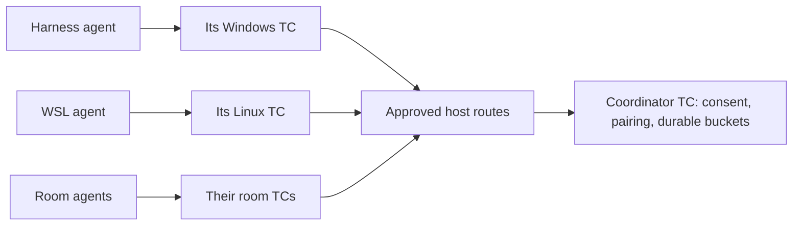

# TC cooperation channels: minimum viable proposal

**Proposed, not implemented.** As of 2026-10-09. This is the recommended first
scope; [the broader design](communication-buckets-v1.md) records later options.
The [shared-filesystem protocol proposal](communication-filesystem-v1.md)
specifies a fixed-size fallback, negotiated compression and signed receipts.

An agent in a harness, session or VM asks its own TC to pair with another agent
for a stated premise. After user approval, or within an explicit standing
cooperation grant, both agents can accept automatically and communicate through
a uniquely identified bucket. Several agents can join one bucket; two can also
open a separate private bucket without leaving their group.

## Start with one authority

One TC acts as the cooperation coordinator and owns the rendezvous, channel
state and durable messages. Other TCs connect through a configured, authenticated
host route. This needs neither a VPN nor a distributed database. Agents continue
using their local MCP or embed; the host adapter forwards the same typed calls.

Use flat channels. A group of eight and a private group of two or three are
independent memberships, not a hierarchy of inherited rights. The coordinator
commits each publication once and exposes it to all approved members, each with
its own ACK cursor. Mesh routing, replicated authorities, automatic council
voting and hierarchical lifecycle rules are later work.

## Reuse what TC already has

| Existing code | Reuse | Required addition |
|---|---|---|
| `StoreClient::open_writer/call`, `crates/daemon/src/store_actor.rs` | Bounded single-writer SQLite actor and acknowledged calls | Communication transactions |
| `EventStore::append`, `crates/store/src/lib.rs` | Transactional sequence assignment and bounded read patterns | Dedicated message rows, membership, invitations and publication receipts |
| Core bucket notifications and subscription wait discipline | Enroll waiter before checking committed cursor again | Wake communication readers after commit |
| `IpcRequest` / request envelopes and `EmbeddedEngine::execute` | Shared typed dispatch, frame bounds, correlation and errors | Communication operation variants and thin MCP projection |
| Configured MCP target routing | Existing local/forwarded-socket connection pattern where supported | Explicit agent identity binding and approved communication route |

Existing output subscriptions are in memory, reset on restart and advance their
cursor before returning a response. They must keep their established behavior.
Communication needs a separate durable ACK cursor: a lost reply must redeliver,
not silently lose a message. Messages also bypass sifters, noise suppression and
output deduplication.

Existing remote targets support an operator-established SSH forward to a local
Unix socket. TC does not establish SSH or currently supply a general TCP/VPN
mesh. Its OS peer checks identify tunnel endpoints, not remote LLMs. The trusted
host route must bind the represented agent/session; a model-written sender name
cannot do that.

## Consent and automatic pairing

The owner grants a purpose, approved peer/audience scope, lifetime, history
visibility and resource limits. No active channel exists without that grant.

An AAP **Automatic cooperation** toggle can create a standing grant for the
current task/team or a broader explicitly selected scope. Under it:

1. Agent A issues a pairing request to an authenticated peer with a premise.
2. TC checks the requested task/purpose scope, audience and limits against the
   standing grant. Free-form premise text explains the request; structured scope
   fields determine authorization.
3. Agent B receives the request through the approved rendezvous and accepts.
4. TC atomically commits membership and an accepted event. Communication starts
   without another user prompt when both participants are already covered.

Outside that scope the request remains pending user approval. Agents cannot
enable the toggle, approve themselves or enlarge the grant. A pairing code is a
public reference to that scoped invitation, not a permission-bearing secret.
New members need existing audience coverage or another user-approved amendment.

The owner can revoke consent or suspend a participant. The coordinator checks
current consent/membership for every operation. Already delivered information
cannot be recalled. A host must isolate its issuer/store from hostile agents;
the API alone cannot constrain a process with unrestricted host-owner rights.

## Small, typed operation set

Use versioned UTF-8 JSON through the same core for MCP and embed:

- Propose/inspect a channel; activate or reject through trusted user control.
- Issue, inspect, accept or revoke a pairing invitation.
- Publish a message with a stable publication ID.
- Pull after the member's durable ACK; acknowledge a contiguous delivered range.
- Inspect status/usage; revoke membership or close the channel.

A message records channel ID, authoritative sequence, message/publication ID,
authenticated sender/session, consent revision, UTC timestamp, optional reply ID,
content type and bounded body. JSON fields never select authoritative sender,
administrator status or user approval.

Statuses distinguish pending consent, active, suspended, closed and revoked;
publication committed/rejected/uncertain; delivered but unacknowledged versus
acknowledged; rate limited, quota full, unavailable route and stale session.
Typed codes and bounded details replace parsing prose.

## Reliability before extra features

Publication checks consent, membership, bounds and quota inside its transaction.
An identical retry under the same sender/publication ID returns its receipt;
changed content conflicts. Retention must preserve enough receipt/tombstone state
to prevent a late retry recreating an expired message. Expired producer/session
generations are rejected explicitly.

Pull does not ACK. ACK positions survive restart and advance only through
messages offered to that member. Delivery is at least once; applications dedup
their effects. A missing reply is reconciled under the original ID, never a new
automatic publication. SQLite failure or an unreachable coordinator yields
failed/uncertain/unavailable, never invented success.

When storage fills, reject/backpressure new publication. Do not silently evict
unread messages. If explicit retention expiry removes data, return an exact gap
before continuing. Give owner revoke/health and other participants' control
traffic bounded reserved capacity. One busy participant must not monopolize
queues, parsing or diagnostics.

## Enforce a few clear limits

Proposed starting values: 16 KiB body, 24 KiB complete message, 32 members,
64 MiB retained bytes per channel, and 10 publications/second per principal with
burst 20. Bound pending invitations, channels, blocking pulls, JSON depth and
per-authority storage. Disclose effective limits; owners may configure them
within the approved budget. These values need measurement, not blind adoption.

Charge rejected attempts as well as accepted traffic. Repeated sustained
violations suspend the authenticated principal across its channels. Reconnects,
renaming or new pairing requests cannot reset its allowance. Only user control
reinstates it. Expose rates, backlog, bytes, quota rejections and cutoff reason;
logs contain metadata rather than message bodies.

Per-message token limits are optional strict limits with an explicitly selected
pinned tokenizer. TC currently has no tokenizer implementation. Never present
character estimates as exact model tokens. If a requested strict cap cannot be
counted, refuse it explicitly. Add one bounded local tokenizer when implementing
that requirement, rather than a general plugin/tokenizer registry. Byte limits
remain mandatory, including before tokenization. Recipient pull budgets are
separate from publication caps.

## Reach isolated environments through their host

TC cannot conjure a route or acquire extra privileges. The user/AAP host enables
one approved bridge; agents then use it automatically within consent.

| Situation | Smallest useful route |
|---|---|
| Two local TC instances | Existing local IPC or direct embed through a trusted host |
| Windows TC and WSL TC | Host bridge using `wsl.exe` process interoperability and bounded stdin/stdout; optional authenticated localhost adapter if networking is suitable |
| Firecracker rooms without shared IP networking | Existing AAP guest/host vsock transport, with the host relaying typed calls |
| Peers sharing a directory, with no usable network route | Explicitly configured filesystem mailboxes carrying the same bounded operations and receipts |
| Separate physical hosts | Configured authenticated tunnel/relay reaching the same coordinator |

The Windows/WSL bridge is an adapter proposal, not an existing TC command.
[Microsoft documents Windows/WSL process interoperability](https://learn.microsoft.com/en-us/windows/dev-environment/wsl-interop).
[Firecracker documents its host/guest vsock bridge](https://github.com/firecracker-microvm/firecracker/blob/main/docs/vsock.md).
Avoid sharing a live SQLite database across Windows and WSL: one process owns
the authoritative store, and clients exchange bounded protocol messages.

A shared project checkout can host an ignored `.tc-coordination/` directory.
Separate Git clones/worktrees do not imply shared files. TC must never discover
authority by scanning arbitrary repositories, modify tracked source files as a
signal, or commit/push live mailbox records. File offers and ACKs are typed data;
they cannot instruct TC to execute code or enlarge user consent.

Use one writer per outbox, immutable exact-size records, bounded polling and
durable reconciliation. Sign authenticated requests and coordinator receipts;
sequence numbers order events, UTC timestamps describe observation, and a hash
chain makes alterations detectable relative to a trusted checkpoint. Compression
is negotiated for message bodies and bounded before and after decoding. Neither
an opaque filename nor a signature alone establishes consent or confidentiality.
Mount guarantees and directory permissions must be checked before advertising
reliable or private delivery.

An externally hosted coordinator can survive a guest restart. If its host,
store or every route is unavailable, report that; emergency mode cannot override
consent or invent delivery. Extra relays and mesh discovery are optional later
adapters, not first-release requirements.

## Acceptance before advertising support

Run the same real transcript through MCP and embed: consent, pairing, group
fanout, independent private channel, publish/pull/ACK and revocation. Add crash
and lost-reply tests proving no duplicate publication, no silent ACK/loss and
honest storage failure. Exercise concurrent one-use invitation acceptance,
oversized/malformed payloads, quota exhaustion and spam across reconnects while
a healthy peer continues. Finally demonstrate Windows/WSL and an AAP guest route
where those adapters are enabled.

These are proposed gates. Communication is not implemented in the current embed
repair. The first build should be this small coordinator service over TC's
existing infrastructure, with the broader mesh/council ideas deferred.
