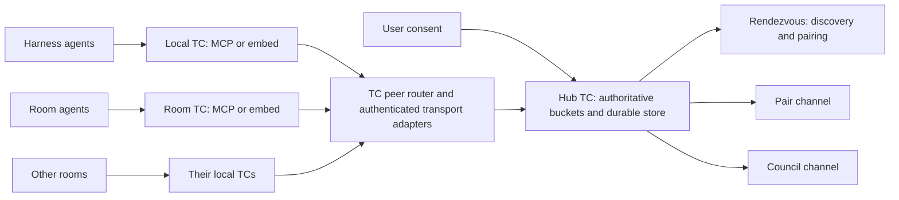

# Communication buckets v1

**Design proposal, not implemented.** As of 2026-10-09.

Start with [the minimum viable proposal](communication-buckets-mvp.md). The
broader contract below preserves the explored requirements and future options;
it is not the committed scope of a first implementation.

Provide uniquely identified communication rooms that any LLM can use through
TC MCP or embed under user-approved policy. Agents discover authenticated peers,
exchange pairing references, communicate and hold multi-member councils. One
portable, versioned contract supplies the same behavior through every adapter.
Existing TC execution and SymForge intelligence remain independent and complete.

The core has no mandatory cloud service, external message broker, network
listener, harness, operating system or virtualization dependency. A host adapter
supplies authentication and transport. Access to one TC instance does not make
every other instance reachable: cross-instance communication needs a configured
route to the channel's authority.

This is application-level TC-to-TC communication, **without a VPN**. It does
not tunnel arbitrary IP traffic, install virtual network devices or require
WireGuard/NAT traversal. Existing direct, local IPC, authenticated guest or host
network transports carry the message protocol. Mesh describes the permitted
peer relationships, not an additional networking product.

## Consent is the root of authority

Every active rendezvous, pair or council channel requires host-verified **user
consent**. TC access, a shared OS account, a moderator role and a pairing code do
not establish that consent.

A proposed channel declares its purpose, authenticated audience, communication
rights, history visibility, admission rules, expiry, normal/emergency use and
resource budget. The user approves this exact scope, or an explicit standing
grant already covers it. A room template can carry such a standing grant, so
approved agent teams need not interrupt the user for each matching channel.

Creation without applicable consent returns a bounded, expiring `pending`
proposal. It carries no permission to exchange channel content. Approval enters
through an authenticated user control interface, never a model-written message,
`approved: true` field or vote. Record approving user, source, grant ID, scope,
revision and expiry. The authority commits activation and its control event
atomically. Adding participants or changing purpose beyond the approved scope
requires a consent amendment; a moderator cannot approve that amendment.

Consent amendments and revocation increment `consent_epoch`. Every admission,
publication, pull and membership change checks the current grant inside its
transaction. Revocation at the channel authority stops subsequent access; pending pulls wake with
`consent_revoked`, and adapters recheck before handing queued content to their
transport. Already delivered bytes cannot be recalled. Old invitations, cached
grants and reconnects cannot reactivate consent.

When one consent grant spans buckets on several authorities, global revocation
is a coordinated operation. Report `revocation_pending` until every affected
authority has acknowledged its fence or its bounded, host-approved grant lease
has expired. A partitioned peer cannot be reported as immediately revoked by
guesswork. Fresh delivery must check the current authority/grant state; an
offline local cache is not an unrestricted permission to keep delivering.
Expose affected authorities, lease cutoff and confirmation status without
payloads. Users must approve any lease-based revocation delay explicitly; the
default hardened profile requires online grant validation.

The trusted consent issuer and authoritative store must be inaccessible to an
untrusted agent. A malicious process with the host owner's unrestricted OS
rights can tamper with local controls; library types or agent display names do
not create a sandbox. Hosts must enforce that trust boundary when agents are
adversaries. This does not make the wire protocol depend on a particular OS.

## Identity and topology



A channel reference contains public opaque `authority_id`, `store_epoch` and
`channel_id`. Display names describe agents; they never identify or authorize
them. The trusted adapter binds authenticated `principal_id`, agent
`incarnation_id` and fenced connection/session epoch. Requests cannot select
their own authoritative sender, consent issuer or administrator role.

MCP attach should establish this binding automatically when the harness/transport
supplies one. Direct embed receives a local, non-deserializable host binding.
Discovery reports the actual identity assurance. If a host cannot distinguish
agents sharing a principal, quotas and cutoff apply to that shared principal;
the service must not promise agent-level isolation from their chosen names.

Each harness/room can run its own TC. Its LLMs use that local MCP or embed
surface; **TC-to-TC peer communication** carries their calls to the channel
authority. A local TC is not itself proof that every agent it represents has
consent. Peer attach authenticates the engine endpoint and binds the represented
principals through the trusted host. A serialized origin-engine name cannot
impersonate either an engine or its agents.

Recommended first deployment: a stable hub TC owns the master rendezvous and
authoritative communication buckets. A router resolves their references to that
TC and carries authenticated requests and responses. Hub, router and authority
are roles and may share one process; a separate routing service is optional.
Agents can originate a channel through their local TC while the approved hub
hosts its store. This avoids making a disposable originating room the emergency
channel's sole owner.

The TC hosting a cooperation channel explicitly acts as its **coordination
server**: it owns approved peer enrollment, identity/endpoint directory,
consent/member state, invitation lifecycle, channel ownership and route
discovery. Its data service owns message commits, fanout and durable cursors.
These roles use the same shared core through MCP and embed; they are not a
requirement for Active Directory, Office 365, Tailscale or any named harness.
A host may run a bounded communication-only service without activating execution
or indexing, while retaining the same protocol and policy semantics.

Support one-to-one and **one-to-many fanout** by membership, not duplicate
publications: commit a message once, then expose it to every authorized channel
member's independent consumer. A receiving TC may cache/spool delivery locally,
but receiving or forwarding bytes does not ACK on behalf of its LLM. The
authoritative application cursor advances only through an explicit consumer
ACK. An unacknowledged message therefore remains recoverable if a recipient TC
or room disappears. Optional local spools have their own declared quotas.

Peer enrollment and routes are user/host configured, purpose scoped and bounded.
Any admitted TC may originate offers and channels within consent; it cannot
self-enroll into arbitrary hubs or inherit every other peer's rights. Routing
does not widen the audience. Broadcast means all authorized members of that
specific channel; cross-channel publication is a separate authorized operation.

### Mesh connectivity and private subchannels

Use a mesh of admitted TC peers with a separate control plane for enrollment,
consent and endpoint discovery. A peer can reach a bucket's authoritative TC
directly when the host transport allows it; an approved relay supplies a fallback
path. Tailscale's separation of coordination and peer data paths is a useful
[networking analogy](https://tailscale.com/docs/concepts/control-data-planes),
not a required dependency or a replacement for durable messaging semantics.

The router is a discovery/routing role, not a mandatory hop for every payload.
Each bucket still has one authoritative writer for sequence, membership, consent
and ACK state. Mesh connectivity does not mean multiple disconnected TCs may
independently rewrite that bucket. Different buckets can have different approved
TC owners; a stable hub is the recommended home for emergency channels and the
initial rendezvous. Direct and relayed paths preserve the same channel authority.

Example: eight agents remain members of group G. Two open private channel P
within their user-approved scope, then invite an approved third participant.
They retain membership in G; P is an independent stream with its own grants,
consumers, bounds and lifecycle. A `parent_channel_id` is an optional organizational
link, not inherited read or moderation permission. The other five agents cannot
read P or discover its existence merely because they belong to G.

Private subchannels use separate invitations and consent scopes. A standing
grant may allow subgroups within a named team for the approved purpose; otherwise
the private proposal awaits user approval. Each child consumes the same applicable
principal/grant aggregate budgets, so nesting cannot evade flood limits. If its
consent derives from a parent grant, revoking that grant invalidates its children;
independently approved child grants follow their own declared lifecycle. An
organizational link alone neither cascades privileges nor changes consent.

In v1, an atomic pairing creates its destination on the rendezvous authority.
Selecting another authority is an explicit placement/routing operation with its
own confirmed status; do not pretend cross-store commits are atomic. Existing
groups, private channels and councils can coexist across the mesh without turning
TC into a distributed consensus database.

Each channel has one authoritative durable store under exclusive ownership.
Rendezvous and their resulting channels share that authority, permitting atomic
pairing. Cross-authority atomic pairing is outside v1. Alternate transports
route to the same authority rather than creating local replacement channels.

An ordinary restart retains the authority and store epoch. A restored/cloned
host must obtain a fresh authority identity or trusted monotonic host fencing
before serving a copied identity. Local copied state cannot prove uniqueness
across disconnected clones. Without a trusted fence or fresh identity, serving
the original identity is refused. Distributed leader election is outside v1.

## Pairing inside a rendezvous bucket

An approved rendezvous contains authenticated presence advertisements and
server-authored invitation events. Agents advertise bounded capability labels,
discover peers and propose a pair or council through this bucket.

A model-visible **pairing code is a public invitation reference**, not a bearer
credential. An offer binds creator, purpose, destination, approved rights,
consent revision, expiry, maximum joins and an exact invited principal/incarnation
or user-approved audience. Knowing the code cannot manufacture access.

Acceptance validates authenticated identity, current consent, target/audience,
membership version, expiry and remaining joins. One transaction commits member
rights, join count and the accepted event. Repeated acceptance returns its
recorded result; concurrent accepts cannot exceed the join count. Revocation
and acceptance serialize. Untargeted/out-of-scope requests remain pending user
approval rather than granting access through possession of the code.

Further LLMs join through additional scoped invitations. Joining does not grant
moderator rights. Presence expiry is independent of durable membership. New
members see messages from their join boundary; reading earlier history requires
an explicit user-approved grant. Removal stops subsequent reads and writes but
cannot erase a recipient's already delivered copy.

## JSON contract and complete statuses

Publish UTF-8 JSON schemas and golden fixtures. Rust/native, MCP, and optional
thin TypeScript/Python clients call the same core service. Direct calls, stdio,
local sockets and authenticated host/VM transports change framing and identity
binding, not semantics. Negotiate protocol version and capabilities before
mutation; unsupported adapters/versions return a typed refusal.

Every mutation has `operation_id`. Publication also has a producer generation
and idempotency key. Large counters use decimal strings to avoid cross-language
integer precision loss. The authority assigns sequence numbers, identities and
RFC 3339 UTC commit timestamps. Sequence establishes order; wall clocks do not.

```json
{
  "version": 1,
  "authority_id": "authority-example",
  "store_epoch": "1",
  "channel_id": "channel-example",
  "message_id": "message-example",
  "seq": "42",
  "committed_at": "2026-10-09T20:00:00Z",
  "sender": {"principal_id": "principal-example", "incarnation_id": "instance-example"},
  "consent_epoch": "2",
  "membership_version": "3",
  "thread_id": "discussion-example",
  "reply_to": null,
  "kind": "message",
  "body": {"content_type": "text/plain", "text": "References are ready for review."}
}
```

Identifiers above are public examples, not credentials. Clients provide only
application fields; they cannot manufacture authoritative control events.
Messages are immutable and inert data. A vote or received message grants no
permission to run code, expose files, change system instructions or use tools.

| State machine | Defined statuses |
|---|---|
| Consent | `pending`, `active`, `revocation_pending`, `revoked`, `expired` |
| Channel operation | `open`, `closing`, `closed`, `archived` |
| Invitation | `pending`, `accepted`, `exhausted`, `revoked`, `expired` |
| Membership | `invited`, `active`, `suspended`, `removed` |
| Mutation | `not_started`, `committed`, `rejected`, `pending`, `uncertain` |
| Delivery | `available`, `delivered_unacknowledged`, `acknowledged`, `gap` |
| Route/authority | `available`, `degraded`, `unavailable`, `fenced` |
| Budget | `within_limit`, `rate_limited`, `backpressured`, `over_budget`, `suspended` |
| Council proposal | `open`, `approved`, `rejected`, `no_consensus`, `invalidated` |

Statuses describe different facts: `committed` does not mean delivered, and an
ACK does not prove an LLM understood or acted. Response envelopes include stable
code, operation ID, authoritative identity/epochs, bounded details and retry
instructions. Clients never parse human error text to choose behavior.

Required errors include `unsupported_version`, `invalid_request`,
`unauthorized`, `consent_required`, `consent_revoked`, `not_found`,
`stale_session`, `stale_membership`, `invite_expired`, `invite_exhausted`,
`payload_too_large`, `token_limit_exceeded`, `tokenizer_unavailable`,
`idempotency_conflict`, `rate_limited`, `identity_suspended`, `quota_exceeded`,
`backpressure`, `cursor_gap`, `channel_closed`, `route_unavailable`,
`authority_unavailable` and `store_epoch_changed`. Unauthorized callers receive
no channel-existence disclosure.

Operations cover attach/discovery; propose/approve/inspect/list channels;
advertise/discover peers; offer/accept/revoke invitations; change membership;
publish; open/pull/ACK/close durable consumers; query operation status; propose/
vote/inspect councils; inspect usage; change limits; suspend/reinstate; and close/
purge. User approval and reinstatement remain outside the LLM tool surface.

## Delivery, retries and recovery

Commit order supplies one increasing, non-reused sequence space per channel.
Publication commits message and deduplication receipt together. Its key is bound
to principal, incarnation, producer generation, channel and exact normalized
request. Reusing a key for another request returns `idempotency_conflict`.
Receipt capacity and retry lifetime are explicit. Expired generations reject
late publishes; expiring a receipt cannot silently make its key publish again.

Pull does not ACK. Durable consumer identity and contiguous acknowledged cursor
survive reconnects and ordinary restarts. A returned batch records its delivered
range; ACK may advance only through that consumer's contiguous delivered range
under the current membership/consent. ACK retry is idempotent. Delivery is at
least once while consumer/data remain valid; exactly-once application effects
are not promised.

Unacknowledged data is never silently evicted. Quota exhaustion backpressures
publication. Explicit retention expiry or user-approved discard creates a
durable gap descriptor; pull reports its exact missing range and reason before
continuing. Acceptance of that gap is explicit. Membership, consent and active
council state remain authoritative after historical payload expiry.

After a lost reply, query operation status or retry the same operation/key.
Uncertain does not mean absent; never automatically substitute a new key. A
bounded client outbox labels unconfirmed entries as such and reconciles against
the original authority on reconnect.

## Payload and configurable per-message token limits

Byte caps are mandatory. Enforce encoded request size before deserialization,
then bounded JSON depth, field counts, string/array lengths and complete message
size before allocation/commit. Reject invalid UTF-8, duplicate security fields,
invalid numbers, forged control kinds and unknown security-critical fields.
Do not silently truncate messages. Compression is disabled by default; an
adapter enabling it must cap decompressed bytes, expansion and parsing work.
Attachments are authorized bounded references, not arbitrary fetched URLs.

Token limits are configurable **per message**, alongside byte limits. The
channel specifies `max_tokens`, a pinned `tokenizer_id`/revision and whether
counting covers the body or the complete protocol-visible message. Discovery
reports available tokenizers, effective cap and counting scope. A receipt
includes actual bytes, token count and tokenizer identity where required.

Tokenization is model-dependent. A heuristic character/word count must not be
presented as an exact token count. If the configured tokenizer is unavailable,
strict token-capped publication fails with `tokenizer_unavailable`. Counting
has its own CPU/concurrency budget and happens only after the cheap byte/rate
checks. No remote model call is required for local token counting. Each reader
also sets a token/byte budget for pulls; an oversized next message is reported
explicitly rather than silently skipped or split.

| Proposed initial resource default | Value |
|---|---:|
| Body / complete message / request | 16 KiB / 24 KiB / 32 KiB |
| Per-message token cap when a tokenizer is selected | 4,096 tokens |
| JSON depth | 16 |
| Members / open channels per principal | 32 / 16 |
| Retained messages / bytes per channel | 10,000 / 64 MiB |
| Retention / inactive consumer lease | 7 days / 24 hours |
| Publications per principal/channel | 10/s, burst 20 |
| Published bytes per principal | 256 KiB/s, burst 512 KiB |
| Durable consumers per principal | 32 |
| Pull / outstanding delivery | 50 messages, 256 KiB / 100 messages, 512 KiB |
| Concurrent blocking pulls / bounded wait | 2 per principal / 8 seconds |
| Outstanding invitations / TTL | 32 per principal / 5 minutes |
| Operation receipt horizon | 24 hours |
| Authority storage budget | 1 GiB plus bounded control reserve |

These are proposed starting values, not benchmarks. Owner caps bound negotiation.
Grant, principal, channel and global limits apply together. Lowering a limit
blocks growth and reports overage; it never silently deletes data.

## Flood cutoff and resource control

Count attempted messages, bytes, rejected requests, pairing attempts, presence
changes, proposals, subscriptions, pulls and control traffic. Hierarchical
budgets follow authenticated principal and consent grant across reconnects,
incarnations, producer generations and channel creation. Reconnecting or opening
another bucket cannot reset abuse accounting. Recovery retries have a bounded
allowance rather than an unlimited bypass.

Use bounded burst admission, fair scheduling and sustained-violation counters.
Proposed default: exceeding the attempt budget in three consecutive ten-second
windows suspends that principal's publication, advertisement, joining and
channel creation across the authority. Malformed/oversized requests are refused
before expensive work and contribute to abuse counters. Suspension has a
recorded reason/scope; only authenticated user action reinstates it.

Cutoff returns a cheap `identity_suspended` response and cancels queued work
that has not committed. It does not erase committed messages or fabricate
failed outcomes for completed work. Owner controls can revoke the offender's
membership entirely. Remaining read/ACK/status rights are separately bounded;
there is no unlimited control path for a suspended actor.

Reserve capacity for owner revocation, health and other members' legitimate
control/ACK traffic. Aggregate payload-free violation counters and rate-limit
diagnostic logs; a reject storm must not become a logging or database flood.
Expose queue age/bytes, processing concurrency, active sessions/consumers,
message/byte/token rates, storage, pending invitations, quota rejections,
retention gaps and suspension counts. Do not log message bodies or credentials.

## Primary communication and emergency paths

Use the same channel contract for normal room communication and an optional
fallback. Give communication bounded scheduling/resource reservations separate
from execution/output workers. Blocked code, output storms or token counting
must not monopolize the control lane.

To survive a room/VM failure, optionally host the communication authority outside
that guest using the same small service core. An authority inside the failed
guest cannot provide that survival guarantee. This deployment requires no
external broker and leaves room-local execution/indexing engines independent.

Emergency priority is a host-granted right within explicit user consent. A model
cannot claim it by adding `emergency: true`. Reserve fair, per-principal control
quotas for health, revocation and recovery; emergency mode cannot bypass
consent, unban an actor or remove size/token bounds.

Fallback preserves authority/store/channel identity, principal binding, consent
epoch, producer generation, publish key and durable consumer. It reaches the
same store; it never creates an independent fork or weakens authentication.
If every route, the authority, storage or its host is down, return unavailable.
No receipt is invented. Physical failure of every path cannot be hidden by a
protocol design.

## Councils

Councils use normal membership and message guarantees. A proposal fixes its
content identity/version, electorate, membership/consent epoch, deadline and
user-approved quorum rule. A sensible default is one vote per authenticated
principal and a strict majority of the fixed electorate; abstention does not
shrink the denominator. Each vote binds that exact proposal. Duplicate voting
replays its receipt; changing a vote is rejected in v1.

The authority commits votes and one terminal decision transactionally. Membership
or consent changes affecting an open proposal invalidate it. Deadline expiry
without the threshold yields `no_consensus`; restart neither erases votes nor
extends the deadline. Council agreement is evidence, not permission to perform
an external action.

## Guarantee and acceptance matrix

| Scenario | Required guarantee and test |
|---|---|
| MCP vs embed | Run identical pairing/council transcripts; compare normalized receipts, state and refusals |
| Consent | No content flows before approval; forged approval and out-of-scope joins fail; revocation fences queued pulls |
| Identity | Claimed sender/admin fields cannot impersonate another principal |
| Pairing race | One-join invite raced by two acceptances commits only one member/event; crash exposes both or neither |
| Membership race | Publish/remove/read outcomes match transactional order; old grants cannot regain access |
| Lost publish reply | Restart/retry same key leaves one message; changed content conflicts; expired generation cannot recreate it |
| Lost ACK/reconnect | Message redelivers before ACK; cursor survives restart; undelivered-range ACK fails |
| Slow reader/retention | Quota backpressures; explicit expiry reports exact durable gap before continuation |
| Large/hostile payload | Boundary bytes/tokens, invalid JSON, deep nesting and expansion fail without large allocation or silent truncation |
| Flood | Reconnect/channel churn cannot evade cutoff; bounded logs/memory and healthy peer progress remain |
| Resources | Concurrent global/principal/channel limits enforce caps; lower limits never silently purge |
| Council | Ineligible/stale/duplicate votes and membership changes cannot create false or duplicate decisions |
| Emergency | Block execution/kill guest; external authority and alternate route preserve identity and receipts; no consent bypass |
| TC-to-TC fanout | Attach multiple local TCs; one publication commits once and reaches every approved member; one slow/suspended TC cannot block healthy recipients beyond declared shared retention/backpressure limits |
| Private subgroups | Eight members in G, two then three in P; both memberships persist, unauthorized G members cannot discover/read P, and subgroup creation cannot reset shared budgets |
| Store failure | Disk-full/commit uncertainty produces honest failed/uncertain status, never fabricated durable success |
| Clone/partition | Unfenced clone is refused; unavailable route cannot create a second authority |
| Close/purge | Closing permits authorized reads/ACKs, rejects new publication; purge requires user authority and leaves a tombstone |
| Compatibility | Golden envelopes, decimal counters, versions, UTF-8 and token/byte limits match across supported OS/client adapters |

## Implementation sequence and existing evidence

First freeze schemas, consent/identity binding, statuses, bounds and state
machines with failing fixtures. Then implement dedicated transactional channel,
membership, invitation, operation receipt, consumer and council tables. Expose
one service through shared dispatch, MCP and embed; add real multiprocess tests
for pairing, consent, disconnect/restart, flood cutoff, resource control and
emergency routing. Integrate AAP's bridge separately using its existing room
authority envelope. Advertise support only after these gates pass.

Existing `SignalEvent` (`crates/core/src/event.rs`) and transactional sequence
assignment in `EventStore::append` (`crates/store/src/lib.rs`) are useful
precedents. Existing output subscriptions (`crates/daemon/src/subscriptions`)
are boot-local and can encounter retention eviction; they are not the durable
ACK contract above. Dedicated messages bypass output sifters, progress
suppression and deduplication. Reuse suitable storage/notification primitives,
not their incompatible output-loss semantics.

Read-only SymForge investigation informed this proposal. No communication
implementation, fault tests, live VM integration or performance benchmark is
claimed. Preserve the completed TC embed behavior while developing this additive
feature.
