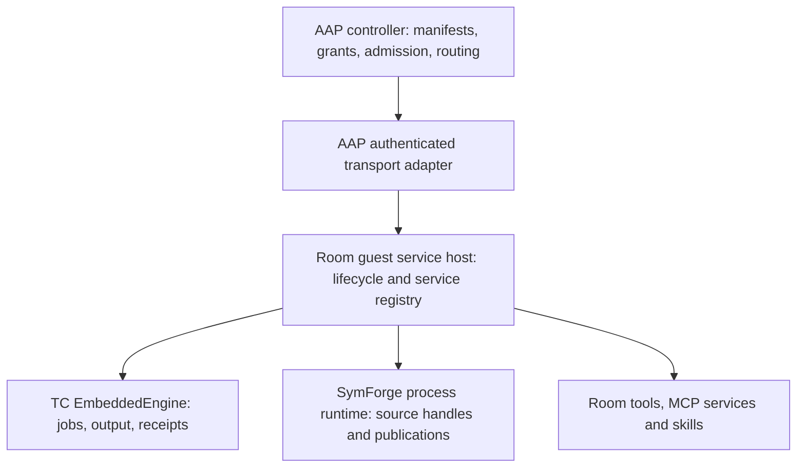

# AAP integration: TC and SymForge room services

As of 2026-10-09. Architecture recommendation grounded in inspected source.
This document does not claim that AAP integration or a new upstream release is
complete. TC's supported entry point and parity matrix are documented in
[EMBEDDING.md](../EMBEDDING.md) and [PARITY.md](PARITY.md).

Use an AAP-owned service bridge with room-local TC and SymForge engines. Keep
the engine APIs independent of the virtualization backend. TC supplies process
execution, supervision, output observation, events and durable receipts.
SymForge supplies code intelligence, publication correctness and guarded edits.
Neither should depend on the other project's private implementation.

## Ownership and resource sharing

The same service calls can use direct in-process dispatch when colocated, the
current authenticated guest channel for Firecracker, or another transport for
a future substrate. Changing the transport must preserve the room's authority
and engine semantics. Room-to-room communication belongs in AAP's authorized
routing layer; the destination room invokes its own engine. TC is the execution
service behind that route.

| Owner | Responsibility |
|---|---|
| AAP controller | Themed room manifests, tool/service/skill selection, LLM context budgets, grants, credential references, resource admission and room placement |
| Guest service host | Actual service launch/connect/invoke/stop, local engine handles, deadline/cancellation coordination, event subscriptions and connection leases |
| TC | Shared dispatcher and policy, process ownership, resource enforcement, raw-byte activity, combed output, terminal receipts and recovery evidence |
| SymForge | Source ownership, indexing/publication lifecycle, bounded queries, complete claims/refusals, guarded mutations and replay reconciliation |
| Substrate adapter | Mounts, namespace/VM isolation, kernel resource budgets, authenticated transport and guest bootstrap after restore |

Start with one TC engine and one SymForge process runtime per room, with
SymForge source handles for that room's projects. Activate engines lazily and
tear them down when idle. Share immutable binaries, base images, vetted
dependency layers and safe content-addressed caches. Keep mutable indexes,
workspace overlays, job/output stores, replay state and credentials owned by
the room's authority boundary.

Measure room startup time, idle/active engine memory, index concurrency, retained
output/disk, process counts and event subscribers before introducing shared
mutable engines across rooms. No resource-saving claim has been benchmarked
here. An in-process embedding removes an extra adapter process, but its engine
and indexing work still consume resources.

For colocated rooms, SymForge's current draft also exposes a
`HostRuntimeOwner` that can admit distinct room/source bindings on one bounded
runtime. The SymForge agent reports native isolation/owner-shutdown tests passing.
This shares runtime infrastructure while retaining independent grants and source
state; it does not expose private guest overlays to a host or cross VM boundaries.
Adopt it only against that agent's final tested contract. TC engines still need
independent configuration/store ownership for each distinct room authority.

## Service envelope

Preserve AAP's existing protocol-v4 room control envelope around service-specific
typed requests. It already carries room/session identity, recovery generation,
workspace fence, operation identity, manifest/capability/permission digests and
deadline. Authentication and authorization must run before engine dispatch.

Each service response should preserve:

- Engine version, service API/schema version, build identity and engine instance.
- Room/session generation and operation identity from the authorized request.
- Typed success, refusal, unavailable, cancelled or uncertain outcome.
- Complete provenance/observation metadata, truncation and response bounds.
- Continuation cursor/publication fence where applicable.
- Cancellation and retry/reconciliation state; a lost reply is not replay permission.

For TC, `execute_envelope(RequestEnvelope)` supplies a serializable engine
boundary without creating a listener or attaching a host daemon. The outer AAP
envelope still owns room authentication, fencing and deadlines. Keep
`EmbeddedAuthority` and engine handles local; never deserialize an administrator
grant from the wire. Use `CommandStartIsolated` for cleared command environments,
absolute executable and explicit cwd. Existing shell/PTY/session lanes retain
their established environment behavior: isolate their engine process at guest
bootstrap when a room requires exact ambient-environment control.

The isolated daemon command lane adds reserved `TC_DAEMON_CHILD=1` to explicit
application env and rejects conflicting values. Include that marker in AAP's
effective child-env validation; it prevents login-shell daemon autostart recursion.
The low-level `ProcessProbe` Clear option itself remains exact.

For SymForge, replace the old internal V10 adapter with the supported process
runtime/source-handle API. The separate agent's current additive parity work has
API version 1, bounded query DTOs and guarded edit/knowledge/replay surfaces.
Freeze the final tested contract with that agent. Its current query claims and
refusals expose metadata through getters; returning only the query value loses
provenance, publication/operation identity, generation and partial/withheld
evidence. Use an upstream supported complete DTO when available, or preserve
every field in an explicit AAP mapper. Mutation authority remains local and is
constructed only after AAP has checked the request's grants.

The 2026-10-09 SymForge read acknowledgement and current integration draft
separate serving process-instance nonce from frozen `source_capture_*`
counters. Preserve both; repeated capture counters after a restart do not
authorize an old continuation. Preserve the semantic operation and SHA-256
canonical argument hash independently of capture evidence. Encoded request and
complete reply-frame limits are separate from decoded query-content budgets.
Never trim provenance, refusal or recovery fields to fit an otherwise oversized
success; return a typed bound refusal.

The SymForge agent also reports a reproduced symbol-replacement overlap defect:
the actual splice can exceed the previously checked range. Its shared MCP/embed
splice fix and session work are still under verification. Final adoption must
include that regression passing and retain byte-exact source/generation/range
evidence; this handoff does not certify the pending fix.

Credential references belong in manifests; resolved values belong in the local
service owner. Give each service/probe its own scoped credentials and
operation-specific readiness check. Advertise a capability only after its
implementation, authorization and current availability are established. A healthy
engine does not prove that every configured MCP service is connected or usable.

## Current AAP evidence

The requested checkout is
`C:/AI_STUFF/PROGRAMMING/Agent_Army_Professionals`, branch
`integrate/rooms-execution-into-main`, inspected HEAD `c70d1abe`. This differs
from the older `aap-kernel-24` worktree used by
[CODEX-REPORT-24-TERMINAL-COMMANDER.md](../reviews/CODEX-REPORT-24-TERMINAL-COMMANDER.md).

Paths in this table are relative to the requested AAP checkout.

| Evidence | Consequence for the recode |
|---|---|
| `crates/aap-guest-agent/src/main.rs:669`, `code_intel.rs:86` construct a guest-local shared code-intelligence service | Keep indexing and execution ownership inside the guest service host |
| `crates/aap-code-intel/src/adapter.rs:30,1137` uses V10 internals; `Cargo.lock:6356` pins SF 10.0.0 at `5348c3e4` | Replace the adapter against the new public API; a version bump alone is insufficient |
| `crates/aap-terminal/src/room_runtime.rs:680,689` returns T097 `NotImplemented`; inspected lockfile has no TC dependency | Implement the actual guest TC service and room port; this checkout has no working TC embed integration |
| `crates/aap-guest-agent/src/protocol.rs:257`, `main.rs:323` define and authorize protocol-v4 room control | Reuse the existing authority envelope rather than adding a generic bypass |
| `crates/aap-backend/src/services/room_components.rs:36`, `crates/aap-agents/src/actors/vm_orchestrator.rs:2697` have real CodeIntel/Exec/FileExists probes but unsupported MCP/TCP probes | Wire real service lifecycle and operation probes; catalog membership is insufficient |
| `crates/aap-core/src/room_config.rs:324,1947` models composition/permissions/resources and validates catalog/costs | Keep it the composition and admission source of truth for frontend themes |
| `crates/aap-workspace/src/host_profile.rs:17` names another substrate, currently represented by declaration/rejection evidence | Preserve an extensible boundary; operational alternate virtualization was not verified |
| `workspace_pool.rs:1185,1214,1729`, `room_pool.rs:160` validate admission, allocate capacity, project cgroup budgets and publish clean layers | Extend these existing mechanisms for engine/index/output costs |

The AAP and SymForge inspection was read-only. No AAP tests, live guests or
resource benchmarks were run. SymForge's inspected parity work was uncommitted
and was not compiled by the TC agent.

## Migration sequence and acceptance

1. Pin the final tested upstream TC and SymForge revisions and aligned TC crates.
   Preserve existing public capabilities and policy; compare the complete TC
   parity matrix with the selected room profile.
2. Replace AAP's SymForge internal adapter and implement its missing guest TC
   room port. Preserve existing AAP ports where useful; make actual engine/build/
   instance discovery authoritative.
3. Wrap typed requests and full results in the existing AAP room authority
   envelope. Validate request bytes before deserialization, complete response
   bounds, grants, generations and deadlines.
4. Wire room service lifecycle, scoped credential resolution and real probes.
   Build themed frontend rooms against these discovered capabilities.
5. Run the same capability fixtures through direct embeds and guest transport:
   discovery, cleared execution, combed output/cursors, cancellation, resources,
   stale generation, disconnect/reconnect, room isolation and recovery.

Recovery must distinguish engine replacement from successful work. TC `JobLost`
and abandoned receipts remain uncertain; do not automatically rerun commands.
SymForge Started/Uncertain mutation effects require reconciliation against
actual target state under its replay contract, not a response cache. A fresh
bootstrap generates new engine identity; restoring a memory snapshot can clone
an existing identity and authority. Renew the outer room generation and
bootstrap engines after restore before admitting new work. Existing vsock
connections must be re-established after restore according to
[Firecracker's snapshot contract](https://github.com/firecracker-microvm/firecracker/blob/main/docs/snapshotting/snapshot-support.md).

Complete AAP's T097 suite and the separate security review required by its report
before mounting its backend invocation surface. Those downstream gates and
upstream publication remain outside this TC implementation's verified scope.
